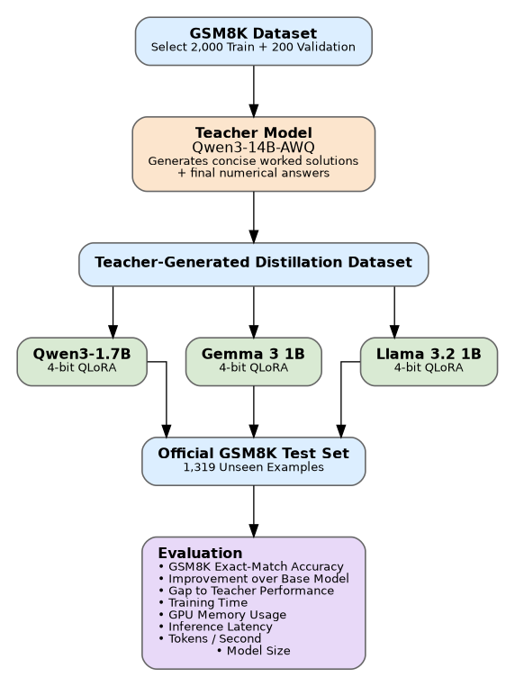

# Knowledge Distillation for Efficient Mathematical Reasoning in Compact Language Models

*(Repo: teacher-student-distillation)*

**Team:** Pick and Parse
**Members:** Priyadarshini Rajmohan · Poojitha Alam · Mounika Akkenapragada

This repository is the shared team repo for the full distillation pipeline: one teacher model and three independent student tracks. **This README covers the shared/root-level pieces and focuses mainly on the teacher model**, since that's owned here. Each student track has its own README inside its subfolder covering that track's setup and training specifics.

## Team structure

### Contributions on this component
| Piece | Who |
|---|---|
| Generation pipeline code (`generate_teacher_gsm8k.py`) | Poojitha Alam (majority) & Priyadarshini Rajmohan |
| Train/val dataset generation — actually run | Priyadarshini Rajmohan |
| Rescue script (`rescue_dollar_rejects.py`) — recovers false-rejects from a calculation-detail regex edge case | Priyadarshini Rajmohan |
| Shared evaluator (`evaluate_gsm8k.py`) | Poojitha Alam & Mounika Akkenapragada |
| Official teacher test-set evaluation (Qwen3-14B-AWQ's accuracy on the full 1,319-question test set) | Mounika Akkenapragada |

| Role | Model | Owner | Details |
|------|--------|--------|---------|
| Teacher + dataset | Qwen3-14B-AWQ | Priyadarshini Rajmohan | See contribution breakdown above. official test-set evaluation run by Mounika Akkenapragada |
| Student — `student/llama/` | Llama-3.2-1B-Instruct | Priyadarshini Rajmohan | `student/llama/README.md` |
| Student — `student/gemma/` | Gemma 3 1B | Poojitha Alam | `student/gemma/README.md` |
| Student — `student/qwen/` | Qwen3-1.7B | Mounika Akkenapragada | `student/qwen/README.md` |

Shared responsibilities: teacher prompts, dataset quality, hyperparameter protocol, audit of results, final report/presentation.

## Pipeline overview

  

## Repository structure (current)

```text
teacher-student-distillation/
├── README.md                     # this file — shared overview, mainly teacher model
├── .gitignore
├── requirements-teacher.txt      # teacher / vLLM stack
├── requirements-llama.txt        # this track's student deps
├── audits/                       # teacher generation accepted/rejected audit records
├── data/                         # shared train/val/test splits, used by all three student tracks
├── outputs/                      # gitignored: adapters, sweep runs, MLflow artifacts
├── teacher/
│   └── generate_teacher_gsm8k.py # teacher dataset generation + validation pipeline
└── student/
    ├── llama/                    # Priyadarshini — see student/llama/README.md for setup/training
    ├── gemma/                    # Poojitha — see student/gemma/README.md for setup/training
    └── qwen/                     # Mounika — see student/qwen/README.md for setup/training
```

Each student subfolder owner maintains their own README with that track's environment setup, training commands, and hyperparameter choices — this file doesn't duplicate that detail.


## Research question

How effectively can knowledge distillation transfer mathematical reasoning capability from a large language model to compact language models while maintaining computational efficiency?

- **Minimal goal:** Generate a teacher dataset from a GSM8K subset; fine-tune three compact students (Qwen3-1.7B, Gemma 3 1B, Llama 3.2 1B) with QLoRA; evaluate each against its own pretrained base on the official GSM8K test split.
- **Ambitious goal:** Compare student architectures under identical training conditions; measure efficiency gains from distillation; analyze how much of the teacher's performance each student retains; investigate whether architecture choice affects distillation effectiveness.
- **Success criterion:** Reproducible adapters + metrics under a fixed protocol so the three student tracks are fairly comparable. A null or small gain is a valid scientific result.

## Architectural differences across student models, and our expectations

The three students are meaningfully different in architecture and training history, not just parameter count:

| | Qwen3-1.7B | Gemma 3 1B | Llama 3.2 1B |
|---|---|---|---|
| Layers | 28 | 26 | 16 |
| Hidden dim | 2048 | 1152 | 2048 |
| Attention | GQA, 16 query heads / 8 key-value heads | Interleaved: 5 local sliding-window layers (1024-token window) per 1 global layer | Standard GQA every layer, 8 KV heads |
| Vocab / tokenizer | BBPE, 151,669 tokens, 119 languages | Gemini 2.0 SentencePiece, 262,144 tokens | BPE, 128,256 tokens |
| Native context | 32,768 tokens | 32,768 tokens (1B variant) | 131,072 tokens |
| Pretraining scale | ~36 trillion tokens | ~2 trillion tokens (1B variant) | Derived from Llama 3.1's pretraining, not trained fresh at comparable scale |
| How it was actually built | Standard large-scale dense pretraining, with an explicit built-in "thinking / non-thinking" reasoning mode | Pretrained, then post-trained with knowledge distillation from a larger instruct model | Built by *pruning* Llama 3.1 8B, then using knowledge distillation (logits from the 8B and 70B models as token-level targets) to recover performance lost during pruning |

**The key observation this surfaces:** two of our three students (Llama 3.2 1B and Gemma 3 1B) are themselves already distilled models, produced from a larger teacher before our project even begins. Qwen3-1.7B, by contrast, is a standard densely-pretrained model with no such distillation lineage, and is also the largest of the three students.

**Our ranked expectation:**

1. **Qwen3-1.7B is expected to reach the highest absolute accuracy after distillation** — it has the most parameters, by far the largest pretraining scale, and a reasoning-oriented ("thinking mode") architecture already aligned with the kind of step-by-step supervision our teacher dataset provides.
2. **Llama 3.2 1B may show the largest *relative* improvement from our distillation step**, even if it doesn't win on final accuracy — its own training history already depends on learning from a larger teacher's logits, which may make it comparatively receptive to a second round of teacher-based fine-tuning.
3. **Gemma 3 1B is the architectural wildcard.** Its interleaved local/global attention (short 1024-token sliding windows for most layers) was designed for long-context memory efficiency, not specifically for reasoning depth. Whether that trade-off costs it anything on a task requiring the model to track a multi-step arithmetic chain within one response is, to our knowledge, untested and is one of the open questions this project can speak to.

**A limitation we want to state upfront, not have pointed out to us later:** if Qwen3-1.7B does turn out strongest, our design cannot fully separate whether that's due to *architecture* (its reasoning-oriented design) or simply *scale* (it has 40–70% more parameters than the other two students). We report and discuss this explicitly in our results rather than treating a win for the larger model as confirmation of an architectural hypothesis.

## The teacher model — Qwen3-14B-AWQ

This is the core piece owned in this repo's root, since every student track depends on it.

**Why Qwen3-14B-AWQ specifically:** the team initially discussed Qwen3-32B or DeepSeek-R1 as the teacher, but both were ruled out on hardware grounds — Qwen3-32B needs ~64GB VRAM at full precision (not possible on a single 24GB GPU), its FP8 form is unreliable on Ampere-generation cards, and AWQ with tensor parallelism would need two confirmed 24GB GPUs, which wasn't available. Qwen3-14B-AWQ was already smoke-tested and running locally via vLLM, making it the lower-risk, immediately workable choice while still being a meaningfully stronger reasoner than any of the ~1-2B students.

**What the teacher pipeline (`teacher/generate_teacher_gsm8k.py`) does:**
- Samples a fixed, reproducible subset of GSM8K (2,000 train + 200 validation examples), with the split cached and fingerprinted against the source dataset so it can't silently drift across reruns.
- Prompts the teacher to produce a tagged `<reasoning>...</reasoning><final_answer>...</final_answer>` output for each problem.
- Validates every generation against a strict quality bar: correct final answer, well-formed tags, a minimum/maximum reasoning length, genuine calculation content (not just a restated total), no excessive repetition, no significant text outside the required tags.
- Retries failed generations up to a fixed attempt limit, with deterministic per-attempt seeding so any regeneration is reproducible.
- Logs every attempt to an append-only event log (`audits/`), so a killed run can resume exactly where it left off without losing or duplicating work, and rejected examples remain available for audit or later recovery.
- Produces a clean, minimal SFT-ready JSONL per split, used identically by all three student tracks.

**Known edge case already handled:** a small number of otherwise-correct generations were being rejected because dollar-sign formatting in a calculation (e.g. `12 * $0.50 = $6.00`) broke the strict calculation-detail regex check. A separate rescue script recovers these specific false-rejects under a deliberately looser (but still validated) pattern, with a full backup taken before any file is modified.

**Teacher evaluation:** run via the shared evaluator (see below) against the official, untouched GSM8K test split, exactly like every student — the teacher's accuracy is the reference point every student's `gap_to_teacher_accuracy` is measured against.

## Data

Primary source: **GSM8K** (grade-school math word problems).

- **Train:** 2,000 examples, teacher-generated worked solutions + final answers
- **Validation:** 200 examples, same generation process
- **Test:** the official GSM8K test split (1,319 examples) — **untouched throughout training**, used exclusively for final evaluation across all three student tracks

Shared files, produced by the teacher pipeline and consumed by every student track:
- `data/train.jsonl`
- `data/val.jsonl`

## Evaluation

Shared across the teacher and all three students — one evaluator, not duplicated per model, so comparisons stay fair:

- `evaluate_gsm8k.py` — model-family-agnostic evaluator (works with Qwen, Llama, or Gemma via `--model`). Supports the teacher (`--backend openai`, pointed at a running vLLM server) and any student (`--backend transformers`, optionally with `--adapter-path` and `--compare-base` for an automatic before/after comparison in one run).
- `poster_analysis.py` — run once predictions exist: McNemar's significance test (was an accuracy difference real, or could it be noise?) and a merge utility to combine all three teammates' `summary.csv` into one team-wide comparison table.

### Metrics reported

| Metric | Purpose |
|--------|---------|
| GSM8K exact-match accuracy | Primary quality metric |
| Improvement over base model | Distillation gain |
| Gap to teacher performance | Remaining headroom |
| Training time | Cost of fine-tuning per student |
| Peak GPU memory usage | Local deployment feasibility |
| Inference latency | Practical speed, per example |
| Generation throughput (tokens/sec) | Practical speed, aggregate |
| Model size | Deployment footprint |
| Trainable parameter count | QLoRA efficiency |
| Output-format success rate | How often a scoreable final answer could be extracted at all |

All three student tracks use the same teacher-generated dataset, identical train/val/test splits, identical prompts and decoding parameters, and the same evaluation script and scoring methodology.

## Results

*Placeholder — fill in once teacher and all three student tracks have been evaluated.*

| Model | Exact-match accuracy | Improvement over base | Gap to teacher | Peak GPU memory | Inference latency | Model size |
|---|---|---|---|---|---|---|
| Teacher (Qwen3-14B-AWQ) | TBD | — | — | TBD | TBD | TBD |
| Llama-3.2-1B (base) | TBD | — | TBD | TBD | TBD | TBD |
| Llama-3.2-1B (after QLoRA) | TBD | TBD | TBD | TBD | TBD | TBD |
| Gemma-3-1B (base) | TBD | — | TBD | TBD | TBD | TBD |
| Gemma-3-1B (after QLoRA) | TBD | TBD | TBD | TBD | TBD | TBD |
| Qwen3-1.7B (base) | TBD | — | TBD | TBD | TBD | TBD |
| Qwen3-1.7B (after QLoRA) | TBD | TBD | TBD | TBD | TBD | TBD |

*Add once available:*
- McNemar significance results for each student's before-vs-after comparison
- McNemar significance results for each student's after-vs-teacher gap
- Cross-model comparison chart (accuracy, latency, memory) across all three students
- A few concrete example outputs (teacher trace vs. student trace) for the report/poster
- Whether the ranked expectation above (Qwen3-1.7B highest accuracy, Llama largest relative gain, Gemma as the open question) held up against the actual results

## Conclusion

*Placeholder — write once Results above is filled in. A few prompts to structure it:*

- **Headline finding:** in one or two sentences, did distillation meaningfully recover reasoning performance across the students, and how consistent was that across architectures?
- **Does distillation effectiveness differ by architecture?** Revisit the ranked expectation above directly — which prediction held, which didn't, and why?
- **Efficiency trade-off:** how do the accuracy gains weigh against the peak memory / latency / model size numbers — is the smallest student "good enough" for the privacy-preserving local-deployment motivation, or does it fall short in practice?
- **Limitations:** training subset size (2,000 examples), reliance on a single teacher model's generations as ground truth (errors in the teacher dataset propagate to all students), and any student where distillation gains were small or null.
- **Why this matters going forward:** tie back to the motivation — privacy-preserving assistants, edge deployment, offline educational tools — what does the result actually tell someone deciding whether a distilled compact model is viable for their use case?

## Risks and mitigations (summary — see full proposal for details)

- **Teacher generation quality:** teacher outputs are verified against GSM8K ground truth; incorrect/malformed generations are regenerated or removed (see the dollar-sign rescue case above as one concrete example already handled).
- **Limited training data:** fixed random seed for reproducibility; subset size may be expanded if time/compute allow.
- **Architecture differences across students:** shared dataset/splits/protocol across all three; only QLoRA target modules are adjusted per architecture where necessary.
- **GPU/compute constraints:** 4-bit QLoRA with gradient accumulation and checkpointing across all students.
- **Uneven distillation effectiveness across architectures:** evaluated under identical conditions regardless of outcome; a null or uneven result is reported as a valid finding, not treated as project failure.

## Privacy perspective

Privacy is the **application motivation**, not a new privacy algorithm. A compact local student keeps prompts on user-controlled hardware. The project discusses that advantage in the report; it does not claim a novel privacy method.

## Ethical considerations

- Uses public benchmarks (GSM8K) and openly published model weights under their respective licenses.
- No human subjects or private user data in the core experiments.
- Llama access requires accepting Meta's community license and acceptable-use policy.
- Teacher-generated demonstrations are verified against GSM8K ground truth before being used for training.
- Results are reported honestly, including negative or small distillation gains.

## Licenses & attribution

- **Qwen3-14B-AWQ / Qwen3-1.7B:** Qwen license / model card on Hugging Face
- **Llama 3.2:** Meta Llama 3.2 Community License — [meta-llama/Llama-3.2-1B-Instruct](https://huggingface.co/meta-llama/Llama-3.2-1B-Instruct)
- **Gemma 3:** Gemma license / model card on Hugging Face
- **GSM8K:** OpenAI GSM8K dataset (see Hugging Face `openai/gsm8k`)
- **Libraries:** PyTorch, Hugging Face Transformers / PEFT / TRL / datasets, bitsandbytes, MLflow, vLLM (teacher) — under their respective open-source licenses

## References

1. Cobbe et al. (2021). *Training Verifiers to Solve Math Word Problems* (GSM8K). https://arxiv.org/abs/2110.14168
2. Qwen Team (2025). *Qwen3 Technical Report.* Alibaba Group.
3. Hu et al. (2021). *LoRA: Low-Rank Adaptation of Large Language Models.* https://arxiv.org/abs/2106.09685
4. Dettmers et al. (2023). *QLoRA: Efficient Finetuning of Quantized LLMs.* NeurIPS 2023. https://arxiv.org/abs/2305.14314
5. Hinton, Vinyals, & Dean (2015). *Distilling the Knowledge in a Neural Network.* NIPS Deep Learning Workshop.
6. Brown et al. (2020). *Language Models are Few-Shot Learners.* NeurIPS 2020.
7. Raffel et al. (2020). *Exploring the Limits of Transfer Learning with a Unified Text-to-Text Transformer (T5).* JMLR.
