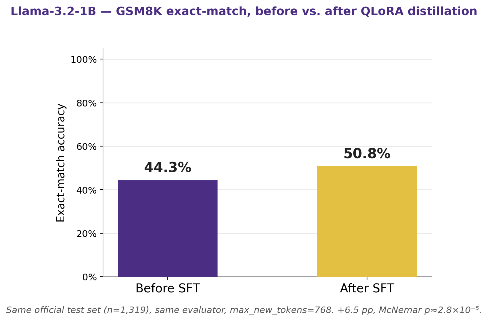
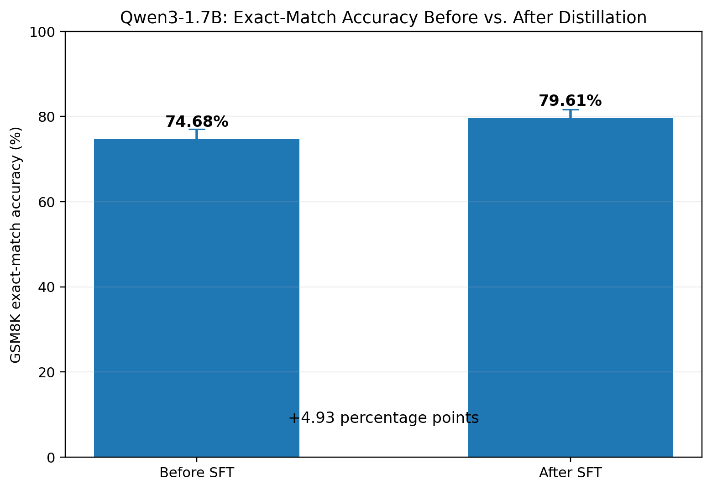
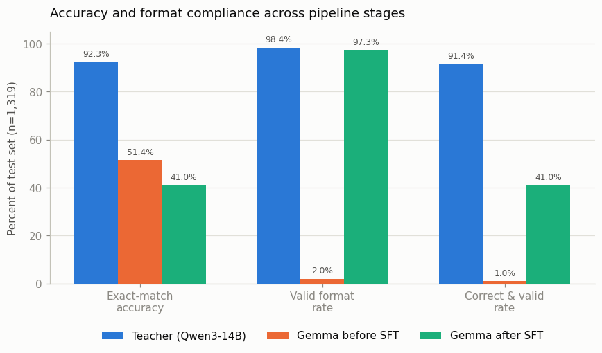

# Knowledge Distillation for Efficient Mathematical Reasoning in Compact Language Models

*(Repo: teacher-student-distillation)*

**Team:** Pick and Parse
**Members:** Priyadarshini Rajmohan · Poojitha Alam · Mounika Akkenapragada

In this project, we investigate whether a large teacher model (Qwen3-14B-AWQ) can effectively transfer mathematical reasoning ability to compact open-weight language models using 4-bit QLoRA fine-tuning. Specifically, we compare multiple student architectures trained on the same teacher-generated reasoning demonstrations and analyze the trade-offs between reasoning accuracy, computational efficiency, and model size. Since different language model families employ distinct architectures and tokenization strategies, it is unclear whether they benefit equally from knowledge distillation. By evaluating multiple compact models under an identical training and evaluation framework, we aim to identify which architecture retains mathematical reasoning capability most effectively after distillation.

**This README covers the shared/root-level pieces and focuses mainly on the teacher model**. Each student track will document setup and training in its own subfolder README.

## Team structure

### Contributions on this component
| Piece | Who |
|---|---|
| Generation pipeline code (`generate_teacher_gsm8k.py`) | Poojitha Alam (majority) & Priyadarshini Rajmohan |
| Train/val dataset generation — actually run | Priyadarshini Rajmohan |
| Shared evaluator (`evaluation/evaluate_gsm8k.py`) | Poojitha Alam & Mounika Akkenapragada |
| Official teacher test-set evaluation (Qwen3-14B-AWQ's accuracy on the full 1,319-question test set) | Initial run: Mounika Akkenapragada. Final official run (after the `gsm8k_teacher_v4` prompt update): Priyadarshini Rajmohan |

| Role | Model | Owner | Details |
|------|--------|--------|---------|
| Teacher + dataset | Qwen3-14B-AWQ | Priyadarshini Rajmohan | See contribution breakdown above. |
| Student — `student/llama/` | Llama-3.2-1B-Instruct | Priyadarshini Rajmohan | Track README: [`student/llama/README.md`](student/llama/README.md) |
| Student — `student/gemma/` | Gemma 3 1B | Poojitha Alam | Track README: [`student/gemma/README.md`](student/gemma/README.md) |
| Student — `student/qwen3/` | Qwen3-1.7B | Mounika Akkenapragada | [`student/qwen3/README.md`](student/qwen3/README.md) |

Shared responsibilities: teacher prompts, dataset quality, hyperparameter protocol, audit of results, final report/presentation.

## Pipeline overview


*Note: the diagram shows an earlier planning snapshot (2,000 train + 200 val). The current `gsm8k_teacher_v4` run samples **2,000 train + 500 val** and keeps **1,922 / 485** accepted supervised fine-tuning (SFT) examples after validation — see [Data](#data).*

## Research question

How effectively can knowledge distillation transfer mathematical reasoning capability from a large language model to compact language models while maintaining computational efficiency?

- **Minimal goal:** Generate a teacher dataset from a GSM8K subset; fine-tune three compact students (Qwen3-1.7B, Gemma 3 1B, Llama 3.2 1B) with Quantized Low-Rank Adaptation (QLoRA); evaluate each against its own pretrained base on the official GSM8K test split.
- **Ambitious goal:** Compare student architectures under identical training conditions; measure efficiency gains from distillation; analyze how much of the teacher's performance each student retains; investigate whether architecture choice affects distillation effectiveness.
- **Success criterion:** Reproducible adapters + metrics under a fixed protocol so the three student tracks are fairly comparable. A null or small gain is a valid scientific result.

## Executive Summary

We distill mathematical reasoning from a large teacher (**Qwen3-14B-AWQ (Activation-aware Weight Quantization)**) into compact students (~1–2B) so they can run locally with lower cost and better privacy.

**Shared pipeline:** generate verified GSM8K teacher chain-of-thought (CoT) traces → QLoRA fine-tune three students (Llama, Gemma, Qwen) under one eval protocol → compare base vs distilled vs teacher.

**Results so far**
- **Teacher ceiling:** **92.27%** exact-match on official GSM8K test.
- **Llama-3.2-1B (complete):** **44.3% → 50.8%** (+6.5 percentage points (pp))
- **Qwen3-1.7B (complete):** **74.68% → 79.61%** (+4.93 pp).
- **Gemma 3 1B (complete):** **51.40% → 41.02%** (−10.39 pp — the only track where exact-match declined, though its correct-and-valid rate rose +40.03 pp).
- **Main takeaway:** distillation reliably teaches the required output format across all three students, but the effect on raw accuracy is not uniform — Llama and Qwen gained accuracy, while Gemma's exact-match fell even as its correct-and-valid rate rose sharply; architecture, scale, and teacher-family match still shape the remaining gaps.

## Architectural differences across student models, and our expectations

The three students are meaningfully different in architecture and training history, not just parameter count:

| | Qwen3-1.7B | Gemma 3 1B | Llama 3.2 1B |
|---|---|---|---|
| Layers | 28 | 26 | 16 |
| Hidden dim | 2048 | 1152 | 2048 |
| Attention | Grouped-query attention (GQA), 16 query heads / 8 key-value heads | Interleaved: 5 local sliding-window layers (512-token window) per 1 global layer, aggressive GQA (4 query heads / 1 shared key-value head) | Standard GQA every layer, 8 KV heads |
| Vocab / tokenizer | Byte-level byte-pair encoding (BBPE), 151,669 tokens, 119 languages | Gemini 2.0 SentencePiece, 262,144 tokens | Byte-pair encoding (BPE), 128,256 tokens |
| Native context | 32,768 tokens | 32,768 tokens (1B variant) | 131,072 tokens |
| Pretraining scale | ~36 trillion tokens | ~2 trillion tokens (1B variant) | Derived from Llama 3.1's pretraining, not trained fresh at comparable scale |
| How it was actually built | Standard large-scale dense pretraining, with an explicit built-in "thinking / non-thinking" reasoning mode | Pretrained, then post-trained with knowledge distillation from a larger instruct model | Built by *pruning* Llama 3.1 8B, then using knowledge distillation (logits from the 8B and 70B models as token-level targets) to recover performance lost during pruning |

**The key observation this surfaces:** two of our three students (Llama 3.2 1B and Gemma 3 1B) are themselves already distilled models, produced from a larger teacher before our project even begins. Qwen3-1.7B, by contrast, is a standard densely-pretrained model with no such distillation lineage, and is also the largest of the three students.

**Our ranked expectation:**

1. **Qwen3-1.7B is expected to reach the highest absolute accuracy after distillation** — it has the most parameters, by far the largest pretraining scale, and a reasoning-oriented ("thinking mode") architecture already aligned with the kind of step-by-step supervision our teacher dataset provides.
2. **Llama 3.2 1B may show the largest *relative* improvement from our distillation step**, even if it doesn't win on final accuracy, its own training history already depends on learning from a larger teacher's logits, which may make it comparatively receptive to a second round of teacher-based fine-tuning.
3. **Gemma 3 1B has documented, targeted training for math reasoning, which sets it apart from the other two students.** Its post-training pipeline explicitly includes reinforcement learning with ground-truth rewards for solving math problems, a dedicated math-reasoning training step neither Qwen3-1.7B's general pretraining nor Llama 3.2 1B's distillation lineage specifically includes. Given its targeted reasoning training, we expect Gemma to outperform Llama at baseline and likely retain some of that edge after distillation. **Outcome:** the first half held — Gemma's baseline (51.40%) did beat Llama's (44.3%) — but the second half didn't: after distillation Gemma fell to 41.02%, behind Llama's 50.8%, so the math-focused post-training edge was not retained. See [Gemma-3-1B-IT (~41%): why distillation underperformed](#gemma-3-1b-it-41-why-distillation-underperformed) below.


## The teacher model — Qwen3-14B-AWQ

This is the core piece owned in this repo's root, since every student track depends on it.

**Why Qwen3-14B-AWQ specifically:** the team initially discussed Qwen3-32B or DeepSeek-R1 as the teacher, but both were ruled out on hardware grounds — Qwen3-32B needs ~64GB VRAM at full precision (not possible on a single 24GB GPU), its FP8 form is unreliable on Ampere-generation cards, and AWQ with tensor parallelism would need two confirmed 24GB GPUs, which wasn't available. Qwen3-14B-AWQ was already smoke-tested and running locally via vLLM, making it the lower-risk, immediately workable choice while still being a meaningfully stronger reasoner than any of the ~1-2B students.

**What the teacher pipeline (`teacher/generate_teacher_gsm8k.py`) does:**
- Samples a fixed, reproducible subset of GSM8K (**2,000 train + 500 validation** examples), with the split cached and fingerprinted against the source dataset so it can't silently drift across reruns.
- Prompts the teacher with **`gsm8k_teacher_v4`**: tagged `<reasoning>...</reasoning><final_answer>...</final_answer>` output, with at most one arithmetic operation per step and symbolic equations (digits/`+ - * / =`) so a small student can follow each step.
- Validates every generation against a strict quality bar: correct final answer, well-formed tags, a minimum/maximum reasoning length, genuine calculation content (not just a restated total), no excessive repetition, no significant text outside the required tags.
- Retries failed generations up to a fixed attempt limit, with deterministic per-attempt seeding so any regeneration is reproducible.
- Logs every attempt to an append-only event log (`audits/`), so a killed run can resume exactly where it left off without losing or duplicating work, and rejected examples remain available for audit or later recovery.
- Produces a clean, minimal SFT-ready JSONL per split, used identically by all three student tracks.

**Teacher evaluation:** run via `evaluation/evaluate_gsm8k.py` against the official, untouched GSM8K test split, exactly like every student. Mounika ran the initial official evaluation; after the teacher prompt was updated to `gsm8k_teacher_v4` (one arithmetic operation per step), Priyadarshini reran the official test-set evaluation to confirm the teacher's ceiling under the current protocol. Current official test exact-match for Qwen3-14B-AWQ: **92.27%** (95% CI 90.9–93.7%; metrics file: `outputs/teacher_testset/Qwen_Qwen3-14B-AWQ_teacher_3cb9a5c9_metrics.json`).

## Data

Primary source: **GSM8K** (grade-school math word problems).

Current shared dataset: prompt version **`gsm8k_teacher_v4`**, config hash `434a9551e7` (run slug `qwen3_14b_awq_gsm8k_teacher_v4_434a9551e7_full`).

| Split | Sampled | Accepted (SFT) | Acceptance rate |
|-------|---------|----------------|-----------------|
| Train | 2,000 | 1,922 | 96.1% |
| Validation | 500 | 485 | 97.0% |
| Test | — | official GSM8K test (1,319) — **untouched** throughout training | — |

Shared files consumed by every student track:
- `data/teacher_gsm8k_train_qwen3_14b_awq_gsm8k_teacher_v4_434a9551e7_full_sft.jsonl`
- `data/teacher_gsm8k_val_qwen3_14b_awq_gsm8k_teacher_v4_434a9551e7_full_sft.jsonl`

## Evaluation

Shared across the teacher and all three students — one evaluator, not duplicated per model, so comparisons stay fair:

- `evaluation/evaluate_gsm8k.py` — model-family-agnostic evaluator (works with Qwen, Llama, or Gemma via `--model`). Supports the teacher (`--backend openai`, pointed at a running vLLM server) and any student (`--backend transformers`, optionally with `--adapter-path` and `--compare-base` for an automatic before/after comparison in one run).
- `evaluation/poster_analysis.py` — run once predictions exist: McNemar's significance test (was an accuracy difference real, or could it be noise?) and a merge utility to combine all three teammates' `summary.csv` into one team-wide comparison table.

### Metrics reported

| Metric | Purpose |
|--------|---------|
| GSM8K exact-match accuracy | Primary quality metric |
| Improvement over base model | Distillation gain |
| Gap to teacher performance | Remaining headroom |
| Training time | Cost of fine-tuning per student |
| Peak GPU memory usage | Local deployment feasibility |
| Inference latency | Practical speed, per example |
| Generation throughput (tokens/sec) | Practical speed, aggregate |
| Model size | Deployment footprint |
| Trainable parameter count | QLoRA efficiency |
| Output-format success rate | How often a scoreable final answer could be extracted at all |

All three student tracks use the same teacher-generated dataset, train/val/test splits, prompt protocol, evaluator, and scoring methodology. The Llama and Qwen student scoreboard runs both use `max_new_tokens=768`; the teacher uses 2048 and is treated as a reference ceiling.

## Results & key findings

All four rows (teacher and all three students) are filled from repository metrics. Students use `max_new_tokens=768`; the teacher uses 2048 and is a reference ceiling.

| Model | Exact-match accuracy | Improvement over base | Gap to teacher | Peak GPU memory | Inference latency | Model size |
|---|---|---|---|---|---|---|
| Teacher (Qwen3-14B-AWQ) | 92.27% | — | — | ~9.7 GB (test) / ~23 GB (gen) | ~2.27 s / ex (test) | 14B AWQ |
| Llama-3.2-1B (base) | 44.3% | — | 48.0 pp | ~2.4 GB | ~2.1 s / ex | ~1.2B |
| Llama-3.2-1B (after QLoRA) | **50.8%** | **+6.5 pp** | **41.5 pp** | ~2.4 GB | ~5.2 s / ex | ~1.2B + ~58 MB adapter |
| Gemma-3-1B (base) | 51.40% | — | 40.86 pp | ~1.89 GiB | ~6.77 s / ex | ~1.0B |
| Gemma-3-1B (after QLoRA) | 41.02% | **−10.39 pp** | **51.25 pp** | ~1.95 GiB | ~17.09 s / ex | ~1.0B + ~49.8 MB adapter |
| Qwen3-1.7B (base) | 74.68% | — | 17.59 pp | ~3.34 GiB | ~14.51 s / ex | ~1.72B |
| Qwen3-1.7B (after QLoRA) | **79.61%** | **+4.93 pp** | **12.66 pp** | ~3.41 GiB | ~32.12 s / ex | ~1.74B + 0.369 GB adapter |

**Key findings**
- Distillation improves both structured-output adherence and mathematical accuracy, while substantial gaps to the teacher reference remain.
- **Llama-3.2-1B:** 44.3% → **50.8%** (+6.5 pp; McNemar \(p \approx 2.8 \times 10^{-5}\)). Valid format ~59% → ~92%. Residual failures are mostly **wrong math with valid tags**. ~41.5 pp still below the teacher (\(p \approx 1.3 \times 10^{-113}\)).
- **Qwen3-1.7B:** 74.68% → **79.61%** (+4.93 pp; continuity-corrected paired McNemar \(p \approx 5.00 \times 10^{-5}\)). Valid format 6.22% → 98.94%. Closes ~28% of its original teacher gap and currently sits closest to the teacher among the completed student tracks.
- **Gemma 3 1B:** exact-match actually fell, from 51.40% to **41.02%** (−10.39 pp; McNemar \(p \approx 4.66 \times 10^{-11}\)) — the only track where accuracy declined. Even so, the model's output structure transferred just as strongly as it did for the other two students, with valid format climbing from 1.97% to 97.35%. Because so few pre-SFT answers could be extracted from a properly formed tag, the fairer correct-and-valid rate actually rose from 0.99% to **41.02%** (+40.03 pp). Gemma is still roughly 51.25 pp behind the teacher on raw exact-match (\(p \approx 1.41 \times 10^{-141}\)), though that gap narrows to 50.34 pp once format is taken into account.

Teacher metrics: `outputs/teacher_testset/Qwen_Qwen3-14B-AWQ_teacher_3cb9a5c9_metrics.json`.  
Llama before: `outputs/llama/before_sft/meta-llama_Llama-3.2-1B-Instruct_before_sft_91626410_max768_metrics.json`.  
Llama after: `outputs/llama/after_sft/meta-llama_Llama-3.2-1B-Instruct_after_sft_35f35fce_max768_metrics.json`.  
Llama McNemar: `outputs/llama/analysis/mcnemar_before_vs_after_max768.json`, `outputs/llama/analysis/mcnemar_student_vs_teacher_max768.json`.  
Charts: `outputs/llama/analysis/llama_accuracy_bars_team_max768.png`, `outputs/llama/curves_89353a18_purple_gold.png`, `outputs/llama/analysis/error_analysis_max768/`.  
Qwen before: `outputs/qwen3/before_sft/Qwen_Qwen3-1.7B_before_sft_672fbe14_before_sft_metrics.json`.  
Qwen after: `outputs/qwen3/after_sft/Qwen_Qwen3-1.7B_after_sft_afcc4197_after_sft_v4_metrics.json`.  
Qwen McNemar: [`mcnemar_before_vs_after.json`](outputs/qwen3/analysis/mcnemar_before_vs_after.json).  
Qwen comparison summary: [`qwen_compare_summary.csv`](outputs/qwen3/analysis/qwen_compare_summary.csv).  
Qwen poster chart: [`qwen_accuracy_bars.png`](outputs/qwen3/analysis/qwen_accuracy_bars.png).  
Gemma before: `outputs/gemma/before_sft/google_gemma-3-1b-it_before_sft_c6683815_fp16_final_metrics.json`.  
Gemma after: `outputs/gemma/after_sft/google_gemma-3-1b-it_after_sft_3a9e3d53_fp16_full_final_metrics.json`.  
Gemma McNemar: [`mcnemar_before_vs_after.json`](outputs/gemma/analysis/mcnemar_before_vs_after.json), [`mcnemar_student_vs_teacher.json`](outputs/gemma/analysis/mcnemar_student_vs_teacher.json).  
Gemma comparison summary: [`gemma_compare_summary.csv`](outputs/gemma/analysis/gemma_compare_summary.csv).  
Gemma poster chart: [`gemma_accuracy_bars.png`](outputs/gemma/analysis/gemma_accuracy_bars.png).

### Llama before vs after SFT (detail)
| Metric | Before SFT | After SFT (best) | Change |
|--------|----------:|-----------------:|--------|
| Exact-match accuracy | 44.3% | **50.8%** | **+6.5 pp** |
| Correct-and-valid rate | 29.4% | **50.7%** | **+21.3 pp** |
| Valid format rate | 58.8% | **92.4%** | **+33.7 pp** |
| Truncation rate | 0.8% | 7.4% | +6.6 pp (longer CoTs) |
| Avg inference latency | ~2.1 s / ex | ~5.2 s / ex | longer generations |
| Peak GPU memory (eval) | ~2.4 GB | ~2.4 GB | similar |
| `max_new_tokens` | 768 | 768 | team-matched student budget |
| Adapter | none | `llama/llama3_1b_v4_r16_lr2e4` | QLoRA r=16, lr=2e-4 |

**What changed:** distillation mainly taught the required tagged format and raised answer accuracy by **+6.5 pp** under matched `max_new_tokens=768`. Remaining errors after SFT are mostly **wrong math with valid tags**, not missing tags.


*Llama GSM8K exact-match before vs after SFT (`max_new_tokens=768`): **44.3% → 50.8%** (+6.5 pp).*

Metrics: [`before`](outputs/llama/before_sft/meta-llama_Llama-3.2-1B-Instruct_before_sft_91626410_max768_metrics.json) · [`after`](outputs/llama/after_sft/meta-llama_Llama-3.2-1B-Instruct_after_sft_35f35fce_max768_metrics.json) · [`mcnemar before/after`](outputs/llama/analysis/mcnemar_before_vs_after_max768.json) · [`mcnemar vs teacher`](outputs/llama/analysis/mcnemar_student_vs_teacher_max768.json).

**Vs Meta’s published Llama-3.2-1B-Instruct GSM8K (44.4%, 8-shot CoT).** Our **50.8%** is higher but **not a strict apples-to-apples beat**: Meta’s number is the untuned Instruct model under 8-shot CoT; ours is **0-shot tagged CoT after GSM8K teacher distillation**. Fair claim: distillation under our tagged protocol lifts this 1B student above both its own base and Meta’s reported 1B band — not that we beat Meta’s training recipe.

### Qwen3-1.7B before vs after SFT (detail)

| Metric | Before SFT | After SFT | Change |
|--------|-----------:|----------:|-------:|
| Exact-match accuracy | 74.68% | **79.61%** | **+4.93 pp** |
| Correct-and-valid rate | 4.17% | **79.53%** | **+75.36 pp** |
| Valid format rate | 6.22% | **98.94%** | **+92.72 pp** |
| Truncation rate | 0.08% | 0.99% | +0.91 pp |
| Avg inference latency | ~14.51 s / ex | ~32.12 s / ex | longer generations |
| Peak GPU memory (eval) | ~3.34 GiB | ~3.41 GiB | similar |
| `max_new_tokens` | 768 | 768 | team-matched student budget |
| Adapter | none | [`qwen3_1_7b_gsm8k_qlora_v4`](outputs/qwen3/qwen3_1_7b_gsm8k_qlora_v4/) | QLoRA r=16, α=32 |


What changed: QLoRA distillation improved Qwen3-1.7B GSM8K exact-match accuracy from 74.68% to 79.61% (+4.93 percentage points) under the same before/after evaluation settings, including max_new_tokens=768. Structured-output adherence also improved substantially, with the valid-format rate increasing from 6.22% to 98.94%. The stricter correct-and-valid metric, which requires both a correct numerical answer and the requested output format, increased from 4.17% to 79.53%. For reference, the Qwen3-14B-AWQ teacher achieved 92.27% exact match; however, the teacher used a larger max_new_tokens=2048 generation budget, so the teacher score should be treated as a reference rather than a directly matched comparison.


*On the same official GSM8K test set, Qwen3-1.7B improved from 74.68% → 79.61% under matched `max_new_tokens=768` before/after settings. The Qwen3-14B-AWQ teacher reference achieved 92.27% using `max_new_tokens=2048`. Full Qwen track: [`student/qwen3/README.md`](student/qwen3/README.md).*


*Same shared GSM8K test at `max_new_tokens=768`: base 74.68% → distilled 79.61% vs teacher 92.27%. Full Qwen track: [`student/qwen3/README.md`](student/qwen3/README.md).*

**Metrics files:**

- Before: `outputs/qwen3/before_sft/Qwen_Qwen3-1.7B_before_sft_672fbe14_before_sft_metrics.json`
- After: `outputs/qwen3/after_sft/Qwen_Qwen3-1.7B_after_sft_afcc4197_after_sft_v4_metrics.json`

Qwen-only depth (training setup, figures, paired analysis, adapter artifacts): [`student/qwen3/README.md`](student/qwen3/README.md).

*Additional analysis:*

- Qwen before-vs.-after paired McNemar test (continuity-corrected): \(p \approx 5.00 \times 10^{-5}\) (157 fixes vs. 92 regressions).
  Artifact: [`mcnemar_before_vs_after.json`](outputs/qwen3/analysis/mcnemar_before_vs_after.json)
- Teacher-gap analysis: distilled Qwen remains **12.66 pp** below the Qwen3-14B-AWQ teacher reference.
  Summary: [`qwen_compare_summary.csv`](outputs/qwen3/analysis/qwen_compare_summary.csv)
- Structured-output transfer: valid-format rate **6.22% → 98.94%**.
  Poster accuracy chart: [`qwen_accuracy_bars.png`](outputs/qwen3/analysis/qwen_accuracy_bars.png)
- Detailed figures and training artifacts: [`student/qwen3/README.md`](student/qwen3/README.md)


### Gemma 3 1B before vs after SFT (detail)

| Metric | Before SFT | After SFT | Change |
|--------|-----------:|----------:|-------:|
| Exact-match accuracy | 51.40% | 41.02% | **−10.39 pp** |
| Correct-and-valid rate | 0.99% | **41.02%** | **+40.03 pp** |
| Valid format rate | 1.97% | **97.35%** | **+95.38 pp** |
| Truncation rate | 5.23% | 2.58% | −2.65 pp |
| Avg inference latency | ~6.77 s / ex | ~17.09 s / ex | longer generations |
| Peak GPU memory (eval) | ~1.89 GiB | ~1.95 GiB | similar |
| `max_new_tokens` | 768 | 768 | team-matched student budget |
| Adapter | none | [`gemma3_1b_qlora_v1/final_best_adapter`](outputs/gemma/gemma3_1b_qlora_v1/final_best_adapter/) | QLoRA r=16, α=32, lr=2e-4 |

**What changed:** unlike Llama and Qwen, distillation did not raise Gemma's raw exact-match — it fell by 10.39 pp (McNemar \(p \approx 4.66 \times 10^{-11}\)), a statistically real effect, not noise. What did transfer, overwhelmingly, was output structure: valid-format rate rose from 1.97% to 97.35%. Before SFT, most of Gemma's "correct" answers were recovered by the evaluator's loose fallback text-scan, not a clean `<final_answer>` tag, since the model almost never produced that tag correctly in the first place. After SFT the model reliably produces the required tags but gets the arithmetic wrong more often inside them: net effect, 145 answers newly correct against 282 newly wrong, out of 1,319. On the fairer correct-and-valid metric, which requires both a right answer and a well-formed tag, Gemma improved substantially: 0.99% → 41.02% (+40.03 pp).


*Gemma GSM8K exact-match, valid-format, and correct-and-valid rate across teacher/before/after (`max_new_tokens=768`): the three metrics do not move together the way they do for Llama and Qwen.*

Metrics: [`before`](outputs/gemma/before_sft/google_gemma-3-1b-it_before_sft_c6683815_fp16_final_metrics.json) · [`after`](outputs/gemma/after_sft/google_gemma-3-1b-it_after_sft_3a9e3d53_fp16_full_final_metrics.json) · [`mcnemar before/after`](outputs/gemma/analysis/mcnemar_before_vs_after.json) · [`mcnemar vs teacher`](outputs/gemma/analysis/mcnemar_student_vs_teacher.json).

**Gap to teacher moved in opposite directions depending on the metric.** On raw exact-match, the gap to the 92.27% teacher *widened* from 40.86 pp to 51.25 pp. On correct-and-valid, the gap *narrowed* from 90.37 pp to 50.34 pp (\(p \approx 1.41 \times 10^{-141}\) for after-SFT vs. teacher). Full Gemma track, including candidate explanations for the accuracy decline: [`student/gemma/README.md`](student/gemma/README.md#why-this-probably-happened).

**Metrics files:**

- Before: `outputs/gemma/before_sft/google_gemma-3-1b-it_before_sft_c6683815_fp16_final_metrics.json`
- After: `outputs/gemma/after_sft/google_gemma-3-1b-it_after_sft_3a9e3d53_fp16_full_final_metrics.json`

Gemma-only depth (setup, McNemar tests, failure-mode breakdown, candidate explanations, reproduction commands): [`student/gemma/README.md`](student/gemma/README.md).

*Additional analysis:*

- Gemma before-vs.-after paired McNemar test (continuity-corrected): \(p \approx 4.66 \times 10^{-11}\) (145 fixes vs. 282 regressions, a net loss of 137 answers).
  Artifact: [`mcnemar_before_vs_after.json`](outputs/gemma/analysis/mcnemar_before_vs_after.json)
- Teacher-gap analysis: distilled Gemma remains **51.25 pp** below the teacher on raw exact-match, but only **50.34 pp** behind on correct-and-valid.
  Summary: [`gemma_compare_summary.csv`](outputs/gemma/analysis/gemma_compare_summary.csv)
- Structured-output transfer: valid-format rate **1.97% → 97.35%**.
  Poster accuracy chart: [`gemma_accuracy_bars.png`](outputs/gemma/analysis/gemma_accuracy_bars.png)
- Detailed figures, failure-mode breakdown, and training artifacts: [`student/gemma/README.md`](student/gemma/README.md)


## Why the students land at different scores


### Qwen3-1.7B (~79%) — why it can sit much closer to the teacher

1. **Same family as the teacher (Qwen → Qwen).** Tokenizer, chat style, and pretraining distribution are closer to the teacher CoTs, so imitation is easier than cross-family transfer.
2. **More capacity.** ~1.7B params, **28 layers**, hidden **2048** — deeper/wider than Llama 1B for multi-step math.
3. **Stronger pretraining scale** (on the order of tens of trillions of tokens) and a built-in **thinking / reasoning** mode aligned with step-by-step supervision.
4. **Not a pruned-down model.** Densely pretrained student, not recovered from aggressive compression like Llama 3.2 1B.

So ~79% is consistent with: *same-family + larger/deeper student + reasoning-oriented pretraining*.

### Llama-3.2-1B (50.8%) — why it lands lower

1. **Cross-family transfer.** Teacher is Qwen; Llama uses a different **BPE** vocab (~128k vs Qwen’s ~152k). Same text becomes different tokens → harder to absorb teacher CoTs.
2. **Shallower network.** Only **16 layers** (vs Qwen’s 28) — less depth for long arithmetic chains even with hidden size 2048.
3. **Build history.** Made by **pruning Llama 3.1 8B** then recovering via knowledge distillation (KD) — already a compressed model before our second distillation step.
4. **What our errors show.** After SFT, format is mostly solved (~92% valid); residual failures are **wrong math with valid tags** (hallucinated reasoning / arithmetic). That is a reasoning/capacity ceiling, not “forgot the tags.”
5. **Still a real win.** Base 44.3% → 50.8% (+6.5 pp, significant, matched `768`). Distillation helps; it just doesn’t close most of the teacher gap (~41.5 pp left).

So ~50.8% is consistent with: *cross-family + shallower 1B + already-pruned lineage + protocol learned better than deep reasoning*.

### Gemma-3-1B-IT (~41%): why distillation underperformed

1. **Strong protocol learning, weak reasoning transfer.** Valid-format compliance improved from about 1.97% to ~97%, while exact-match accuracy decreased from about 51.4% to ~41%. Gemma learned the required `<reasoning>` and `<final_answer>` structure very effectively, but this did not translate into stronger mathematical reasoning.
2. **SFT reduced pretrained reasoning performance.** The base Gemma model already achieved about 51.4% GSM8K accuracy. After SFT, performance fell below this baseline, indicating that adaptation did not preserve all of the useful reasoning ability already present in the instruction-tuned model.
3. **Multi-step calculation state errors.** Error analysis showed failures such as losing an intermediate total, dropping a quantity, mishandling a sign, or performing an unnecessary operation after reaching a correct intermediate result, a sign of difficulty maintaining numerical and reasoning state across multiple calculation steps, not simple arithmetic weakness.
4. **Concise reasoning did not recover performance.** Replacing the rigid one-operation-per-step style with a concise step-by-step prompt still resulted in about 39% accuracy, so excessive verbosity or rigid step structure was not the primary cause of the degradation.
5. **Strong teacher quality shifts the bottleneck to student adaptation.** The Qwen teacher achieved 92.27% GSM8K accuracy, so weak teacher performance is unlikely to explain Gemma's low score. The results instead point toward the student-side SFT/distillation process as the more likely source of degradation.
6. **Architecture may contribute.** Gemma 3 1B uses 26 layers, hidden size 1152, 4 query heads / 1 KV head, and 5-local : 1-global attention. Its tighter KV sharing may make multi-step value tracking harder, though this remains a hypothesis.

So ~41% is consistent with: *strong format learning + weak reasoning transfer + reduced post-SFT performance + multi-step calculation-state errors + an architecture-driven bottleneck, not weak teacher quality or excessive reasoning length*.

## Conclusion

Distilling Qwen3-14B-AWQ GSM8K CoTs into compact students under one shared protocol produced model-dependent results.

Llama-3.2-1B improved from 44.3% → 50.8% (+6.5 pp) and Qwen3-1.7B from 74.68% → 79.61% (+4.93 pp), with strong gains in output-format compliance but only partial transfer of the teacher's 92.27% accuracy.

Gemma-3-1B-IT improved strongly in format compliance, from about 1.97% valid format to ~97%, but its exact-match accuracy dropped from about 51.4% to ~41% after SFT. Its remaining failures were mainly multi-step calculation state errors, and concise reasoning did not recover accuracy. This suggests Gemma learned the response protocol very well, but not the underlying reasoning skill.

Overall, reasoning distillation is highly student-dependent: Qwen benefited most, Llama improved moderately, while Gemma improved formatting but lost mathematical accuracy. Most of the gap to the 92.27% teacher remains: widest for cross-family Llama (~41.5 pp) and Gemma (~51.3 pp), narrower for same-family Qwen (~12.7 pp). The compact students remain lightweight (~1.9–3.4 GB) and practical for local, privacy-friendly use, but they are not replacements for the 14B teacher. Main caveats are the 2,000-example subset, single teacher/benchmark, and one selected run per student.

## Repository structure (current)

```text
teacher-student-distillation/
├── README.md                     # this file — shared overview, mainly teacher model
├── .gitignore
├── requirements-teacher.txt      # teacher / vLLM stack
├── audits/                       # teacher generation accepted/rejected audit records
├── data/                         # shared train/val SFT JSONL used by all student tracks
├── evaluation/
│   ├── evaluate_gsm8k.py         # shared teacher + student evaluator
│   └── poster_analysis.py        # McNemar + team summary merge
├── outputs/                      # run manifests, metrics, predictions (adapters may be gitignored)
├── teacher/
│   ├── generate_teacher_gsm8k.py # teacher dataset generation + validation pipeline
│   ├── rescue_dollar_rejects.py  # recover validated dollar-format false rejects
│   └── project_pipeline.png      # high-level pipeline diagram
└── student/
    ├── llama/                    # Priyadarshini — track README + requirements-llama.txt
    ├── gemma/                    # Poojitha — track README
    └── qwen3/                    # Mounika — track README
```

Each student subfolder owner will maintain their own README with that track's environment setup, training commands, and hyperparameter choices — this file doesn't duplicate that detail.

## Compute / GPU usage

Teacher generation (train + val) and teacher test eval were run with different batching settings, so peak VRAM is reported separately. Generation config `max_tokens` is **2048** (see run manifest); train/val peak ~23 GB was observed at **batch size 4** on the vLLM teacher server.

| Model | Stage | Batch size | Max tokens | Peak GPU memory |
|-------|--------|------------|------------|-----------------|
| Teacher (Qwen3-14B-AWQ) | Train + val generation | 4 | 2048 | ~23 GB |
| Teacher (Qwen3-14B-AWQ) | Official test eval | 1 | 2048 | ~9.7 GB |
| Llama-3.2-1B (QLoRA train) | Fine-tuning (`train_v3`, r=16, lr=2e-4, eff. batch 16, max_seq 1024) | 4 × accum 4 | 1024 (seq) / gen-eval **768** | ~4-bit QLoRA on 24GB class GPU; wall-clock ~30 min / run |
| Llama-3.2-1B (base eval) | Official test (before SFT, bf16, v4 prompt, max768) | 1 | **768** | ~2.4 GB |
| Llama-3.2-1B (after QLoRA eval) | Official test (best adapter, max768) | 1 | **768** | ~2.4 GB |
| Gemma-3-1B (QLoRA train) | Fine-tuning (`gemma_qlora_training.ipynb`, r=16, lr=2e-4, eff. batch 16, max_seq 1536, 3 epochs) | 2 × accum 8 | 1536 (seq) / gen-eval **768** | 4-bit QLoRA on a Colab T4 (14.56 GiB); wall-clock ~43.7 min |
| Gemma-3-1B (base eval) | Official test (before SFT, fp16, max768) | 1 | **768** | ~1.89 GiB |
| Gemma-3-1B (after QLoRA eval) | Official test (best adapter, max768) | 1 | **768** | ~1.95 GiB |
| Qwen3-1.7B (QLoRA train) | Fine-tuning (3 epochs, max seq 1536) | 1 × accum 8 | 1536 (seq) | 4-bit QLoRA; ~94 min |
| Qwen3-1.7B (base eval) | Official test | 1 | **768** | ~3.34 GiB |
| Qwen3-1.7B (after QLoRA eval) | Official test | 1 | **768** | ~3.41 GiB |

## Risks and mitigations (summary — see full proposal for details)

- **Teacher prompt/data iteration cost:** revising the teacher prompt for hard problems required a full dataset regeneration and retraining cycle before the real issues surfaced. **Mitigation:** pilot new prompts on a small subset (~500 examples) through the full loop before scaling to all 2,000.
- **Limited training data:** fixed random seed for reproducibility; subset size may be expanded if time/compute allow.
- **Architecture differences across students:** shared dataset/splits/protocol across all three; only QLoRA target modules are adjusted per architecture where necessary.
- **GPU/compute constraints:** 4-bit QLoRA with gradient accumulation and checkpointing across all students.
- **Uneven distillation effectiveness across architectures:** evaluated under identical conditions regardless of outcome; a null or uneven result is reported as a valid finding, not treated as project failure.

## Privacy perspective

Privacy is the **application motivation**, not a new privacy algorithm. A compact local student keeps prompts on user-controlled hardware. The project discusses that advantage in the report; it does not claim a novel privacy method.

## Ethical considerations

- Uses public benchmarks (GSM8K) and openly published model weights under their respective licenses.
- No human subjects or private user data in the core experiments.
- Llama access requires accepting Meta's community license and acceptable-use policy.
- Teacher-generated demonstrations are verified against GSM8K ground truth before being used for training.
- Results are reported honestly, including negative or small distillation gains.

## Licenses & attribution

- **Qwen3-14B-AWQ / Qwen3-1.7B:** Qwen license / model card on Hugging Face
- **Llama 3.2:** Meta Llama 3.2 Community License — [meta-llama/Llama-3.2-1B-Instruct](https://huggingface.co/meta-llama/Llama-3.2-1B-Instruct)
- **Gemma 3:** Gemma license / model card on Hugging Face
- **GSM8K:** OpenAI GSM8K dataset (see Hugging Face `openai/gsm8k`)
- **Libraries:** PyTorch, Hugging Face Transformers / PEFT / TRL / datasets, bitsandbytes, MLflow, vLLM (teacher) — under their respective open-source licenses

## References

1. Cobbe et al. (2021). *Training Verifiers to Solve Math Word Problems* (GSM8K). https://arxiv.org/abs/2110.14168
2. Qwen Team (2025). *Qwen3 Technical Report.* Alibaba Group.
3. Hu et al. (2021). *LoRA: Low-Rank Adaptation of Large Language Models.* https://arxiv.org/abs/2106.09685
4. Dettmers et al. (2023). *QLoRA: Efficient Finetuning of Quantized LLMs.* NeurIPS 2023. https://arxiv.org/abs/2305.14314
5. Hinton, Vinyals, & Dean (2015). *Distilling the Knowledge in a Neural Network.* NIPS Deep Learning Workshop.
6. Brown et al. (2020). *Language Models are Few-Shot Learners.* NeurIPS 2020.
7. Raffel et al. (2020). *Exploring the Limits of Transfer Learning with a Unified Text-to-Text Transformer (T5).* JMLR.
