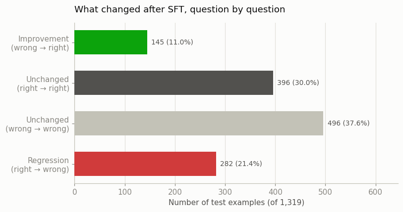
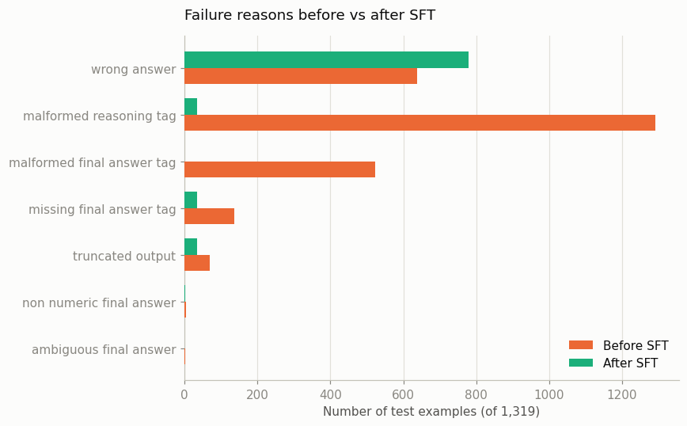

# Gemma-3-1B-it: Reasoning Distillation on GSM8K

**Does knowledge distillation from a large teacher transfer mathematical reasoning to a compact Gemma student?**

Team: Pick and Parse (Priyadarshini Rajmohan, Poojitha Alam, Mounika Akkenapragada). This track (Gemma-3-1B-it): Poojitha Alam.

This is the Gemma-3-1B-it student track of the team's teacher-student distillation project: 4-bit QLoRA fine-tuning `google/gemma-3-1b-it` on GSM8K chain-of-thought demonstrations generated by the shared Qwen3-14B-AWQ teacher, then evaluating it against its own untuned baseline and the teacher on the official GSM8K test split. The root README covers the shared pipeline (teacher, data, evaluator) across all three student tracks; this file is self-contained for Gemma: setup, results, and how to reproduce them.

---

## Preview

| Section | What you'll find |
|---------|------------------|
| [Research question](#research-question) | What this track asks, and how success is judged |
| [Motivation](#motivation) / [Use cases](#use-cases) | Why this transfer question matters, and who a result like this helps |
| [Approach & rationale](#approach-rationale) | Why 4-bit QLoRA, reasoning-tagged targets, the shared evaluator, and Colab |
| [Requirements](#requirements) / [Setup](#setup) | GPU/Python/disk needs, and step-by-step environment setup |
| [Usage](#usage) | Exact eval commands and flags for base and distilled runs |
| [Troubleshooting](#troubleshooting) | Real errors hit during this run, and their fixes |
| [Metrics used for evaluation](#metrics-used-for-evaluation) | Exact-match, valid-format, correct-and-valid, and McNemar, each with source-line references |
| [Input / Output](#input-output) | What the model is prompted with, and what's scored |
| [Data](#data) / [Recipe](#recipe) | Shared training data, and the exact hyperparameters used |
| [Results](#results) | Headline numbers, the accuracy paradox, full metrics, and why it probably happened |
| [Conclusion](#conclusion) | Format transfer vs. reasoning transfer, and the bottom line |
| [Next steps](#next-steps) | Concrete follow-up experiments to isolate the cause |
| [Repository contents](#repository-contents) / [Reproduce](#reproduce) | File map, and copy-paste reproduction commands |
| [Risks & mitigations](#risks-mitigations) / [Ethical considerations](#ethical-considerations) | Known failure points and how they're handled; data/model provenance |

---

## Research question

Can QLoRA fine-tuning on a shared teacher's chain-of-thought demonstrations raise a compact Gemma student's GSM8K accuracy under a fixed evaluation protocol, and does gaining the required output format necessarily come with a gain in the underlying reasoning?

- **Goal:** train one QLoRA adapter on the shared teacher demonstrations, evaluate Gemma before and after under the same evaluator used for the teacher, and decompose any accuracy change into format-compliance transfer versus reasoning-accuracy transfer using paired (McNemar) significance tests and a failure-mode breakdown.
- **Success criterion:** a reproducible before/after/teacher comparison with statistical backing for any claimed change. A result where accuracy does not improve, or gets worse, is a valid, reportable outcome, not a failed run, as long as it's measured honestly.

---

## Motivation

Large teacher models are accurate but expensive to run and require sending user data to a remote server. A small, locally runnable student distilled from the teacher's reasoning traces could offer similar utility at lower cost, latency, and privacy exposure, if the transfer actually works. This track answers that empirically for one compact model, `google/gemma-3-1b-it`.

## Use cases

A before/after/teacher-referenced result like this one helps model selectors judge whether a ~1B local model is viable for math-assistance features, and anyone reproducing or extending this setup, since the exact recipe, environment, and failure modes are documented below.

---

## Approach & rationale

Why this design, specifically:

- **4-bit QLoRA, not full fine-tuning.** Full fine-tuning of a ~1B model is unnecessary here. NF4 quantization plus a LoRA adapter (13,045,760 trainable parameters, ~1.29% of the loaded model) trains on a single Colab GPU and produces a small, portable adapter (~49.8 MB) instead of a full model copy.
- **Reasoning-tagged targets, not answer-only targets.** Training data uses the teacher's full `<reasoning>...</reasoning><final_answer>...</final_answer>` traces, so the student is supervised on *how* to reach an answer, not just what it is. Whether that supervision actually improved reasoning, versus only the output shape, is what [Results](#results) measures.
- **Evaluation is shared and model-family-agnostic.** `evaluation/evaluate_gsm8k.py` is the same script used for the teacher and every student, with fixed decoding (greedy, `temperature=0.0`, `seed=42`) and a fixed prompt, so the before/after comparison isn't confounded by evaluator differences.
- **A fallback answer extractor, with an explicit ambiguity guard.** If a response has no valid `<final_answer>` tag, the evaluator falls back to a looser text-scan (`extract_fallback_answer`, [`evaluate_gsm8k.py:497`](../../evaluation/evaluate_gsm8k.py#L497)) instead of scoring it as simply wrong. That path matters a great deal here: most of Gemma's pre-training "correct" answers are recovered this way, not from a clean tag (see [Results](#results)).
- **Colab, not a local script, for training.** The notebook (not a CLI script) auto-resumes from checkpoints if the Colab session disconnects, and every hyperparameter lives in one configuration cell (see [Setup](#setup)), so a rerun can't silently drift from the reported recipe.

---

## Requirements

- **GPU (training):** 4-bit QLoRA fits on a single Colab T4 (14.56 GiB total capacity); the training run reported here used exactly that.
- **GPU (evaluation):** the evaluator runs Gemma in full `float16`, not 4-bit (`--load-in-4bit` is a separate, unused flag for this track); peak memory observed was ~1.89 GiB (before SFT) and ~1.95 GiB (after SFT), well under a T4's capacity.
- **Python:** 3.12 (the Colab runtime's default at the time of this run, confirmed from the environment-check cell's library paths).
- **Disk:** ~2 GB for the `google/gemma-3-1b-it` checkpoint (downloaded automatically via `from_pretrained`), plus ~50 MB per saved LoRA adapter.
- **Access:** a Hugging Face account with the Gemma 3 license accepted on the [model card](https://huggingface.co/google/gemma-3-1b-it) (Gemma is gated).

---

## Setup

### 1. Install the pinned package versions

```bash
pip install -r student/gemma/requirements-gemma.txt
```

This installs `transformers==4.56.2`, `peft`, `accelerate`, `bitsandbytes`, `datasets`, `sentencepiece`, and `torchao`; see [`requirements-gemma.txt`](requirements-gemma.txt) for exact constraints and the resolved versions from the reported run. `torch`/CUDA are provided by the Colab runtime itself, not installed by this file.

### 2. Authenticate with Hugging Face

```bash
huggingface-cli login
```

Required because `google/gemma-3-1b-it` is a gated model; the login must belong to an account that has accepted Gemma's license on the model card.

### 3. Place the shared teacher-generated data

The training notebook expects the shared SFT files at `data/teacher_gsm8k_{train,val}_..._full_sft.jsonl` (see [Data](#data) below): either this repo's copy or your own copy in Google Drive if running in Colab.

### 4. Train

Open [`gemma_qlora_training.ipynb`](gemma_qlora_training.ipynb) in Colab and run all cells. The first cell mounts Drive; the experiment configuration cell near the top (`EXPERIMENT_NAME = "v1"`) holds every hyperparameter, and the last cell saves the adapter plus a `training_summary.json`. See [Recipe](#recipe) for the exact values used for the reported run.

---

## Usage

**Evaluate the base model (before SFT):**
```bash
python evaluation/evaluate_gsm8k.py \
  --backend transformers --model google/gemma-3-1b-it \
  --stage before_sft --max-input-tokens 1536 --max-new-tokens 768
```

**Evaluate the distilled model (after SFT):**
```bash
python evaluation/evaluate_gsm8k.py \
  --backend transformers --model google/gemma-3-1b-it \
  --adapter-path outputs/gemma/gemma3_1b_qlora_v1/final_best_adapter \
  --stage after_sft --max-input-tokens 1536 --max-new-tokens 768
```

Key flags used for this track (full list: `python evaluation/evaluate_gsm8k.py --help`):

| Flag | Value used | Notes |
|---|---|---|
| `--backend` | `transformers` | local Hugging Face inference, not the vLLM/OpenAI path used for the teacher |
| `--model` | `google/gemma-3-1b-it` | |
| `--adapter-path` | *(after_sft only)* `outputs/gemma/gemma3_1b_qlora_v1/final_best_adapter` | omit for the base-model run |
| `--stage` | `before_sft` / `after_sft` | labels output filenames and the metrics/summary metadata; does not change generation or scoring |
| `--max-input-tokens` | `1536` | prompt truncation limit |
| `--max-new-tokens` | `768` | team-matched generation budget |
| `--dtype` | `float16` (default `auto` resolves to this) | full precision, not 4-bit, at eval time |

**Run the paired significance tests and poster chart:** see [Reproduce](#reproduce).

---

## Troubleshooting

- **`XetAuthorizationError` or a Hugging Face Hub / Transformers version conflict:** this is why the training notebook's second cell force-reinstalls a specific hub version (`pip uninstall -y huggingface-hub hf-xet && pip install --force-reinstall "huggingface-hub==0.36.2"`) before anything else runs. If you hit this outside the notebook, apply the same fix.
- **`WARNING:torchao:Failed to load .../torchao/_C_cutlass_90a.abi3.so` (or a similar `_C_mxfp8...` message) during environment checks:** harmless on a T4. These are CUDA-architecture-specific `torchao` kernels the GPU does not need; training completes normally despite the warning.
- **`PeftModel`/adapter load error mismatched with the installed `torchao` version:** the after-SFT evaluation notebook upgrades `torchao` to `0.17.0` specifically so PEFT can load a LoRA adapter trained under a newer PyTorch. If loading a saved adapter fails, check the `torchao` version first.
- **`403`/gated-repo error loading `google/gemma-3-1b-it`:** the logged-in Hugging Face account has not accepted Gemma's license yet; accept it on the [model card](https://huggingface.co/google/gemma-3-1b-it), then retry.
- **Colab session disconnects mid-training:** the training notebook checks `OUTPUT_DIR` for an existing checkpoint before starting and resumes from it automatically; rerunning the training cells after a disconnect is safe and does not restart from scratch.

---

## Metrics used for evaluation

All computed in `evaluation/evaluate_gsm8k.py`; no external eval harness:

- **Exact-match accuracy** (`exact_match_accuracy`): the primary metric. An answer is extracted from a well-formed `<final_answer>` tag if present, otherwise from a fallback text-scan (`extract_fallback_answer`, [`evaluate_gsm8k.py:497`](../../evaluation/evaluate_gsm8k.py#L497)), and compared against the gold GSM8K answer (`answers_match`, [`evaluate_gsm8k.py:557`](../../evaluation/evaluate_gsm8k.py#L557), called at [`evaluate_gsm8k.py:632`](../../evaluation/evaluate_gsm8k.py#L632)). A response with more than one independent number inside `<final_answer>` (e.g. "8 or 10") is scored as an unresolved ambiguity, not a lucky guess, rather than silently taking the first number.
- **Valid format rate** (`valid_format_rate`): the fraction of responses with no format-failure reason present (missing or malformed `<reasoning>`/`<final_answer>` tags, or an empty reasoning tag), computed at [`evaluate_gsm8k.py:644`](../../evaluation/evaluate_gsm8k.py#L644).
- **Correct-and-valid rate** (`correct_and_valid_rate`): `is_correct AND is_valid_format` ([`evaluate_gsm8k.py:645`](../../evaluation/evaluate_gsm8k.py#L645)). This is the fairer headline metric for this track specifically, since it does not let a lucky fallback-scanned answer with no real structure count as a full success.
- **Answer source** (`answer_source`, per-example field: `final_answer_tag` / `fallback` / `missing`): not an aggregate metric itself, but the field that explains *why* exact-match and correct-and-valid diverge so sharply for Gemma before SFT (see [Results](#results)).
- **Question-level paired significance** (McNemar's test, `evaluation/poster_analysis.py`): given two prediction files scored on the same 1,319 `problem_id`s, computes the 2×2 discordant-pair table and an exact binomial or continuity-corrected chi-square p-value depending on sample size (`mcnemar_test`, [`poster_analysis.py:93`](../../evaluation/poster_analysis.py#L93)). Used here for both before-vs-after and after-vs-teacher.

---

## Input / Output

**What the model receives**, identically for base and distilled runs: a fixed system prompt instructing step-by-step reasoning with at most one arithmetic operation per step, tagged `<reasoning>`/`<final_answer>` output ([`evaluate_gsm8k.py:106`](../../evaluation/evaluate_gsm8k.py#L106)), and a user turn of `"Problem:\n{question}"` ([`evaluate_gsm8k.py:114`](../../evaluation/evaluate_gsm8k.py#L114)), applied through the model's chat template and truncated to `--max-input-tokens 1536`.

**What comes back:** one greedy-decoded completion per question (`temperature=0.0`, `top_p=1.0`, `seed=42`, up to `max_new_tokens=768`), parsed for tag structure, then scored as described in [Metrics](#metrics-used-for-evaluation). Per-example results (`raw_output`, `predicted_answer`, `answer_source`, `is_correct`, `is_valid_format`, `validation_errors`, ...) are written to a `_predictions.jsonl`; aggregate rates are written to a `_metrics.json`.

---

## Data

Shared teacher-generated GSM8K data, identical for every student track: 1,922 train / 485 val ([`data/`](../../data/)), scored against the untouched official 1,319-question GSM8K test split.

---

## Recipe

| Knob | Value |
|------|------|
| Base model | `google/gemma-3-1b-it` |
| Method | 4-bit QLoRA, NF4 quantization, float16 compute (assistant-token loss only) |
| Teacher data | `gsm8k_teacher_v4` / hash `434a9551e7` (1,922 train / 485 val) |
| Learning rate | `2e-4`, linear schedule, warmup ratio 0.03 |
| LoRA r / α / dropout | `16` / `32` / `0.05` |
| Target modules | `q_proj, k_proj, v_proj, o_proj, gate_proj, up_proj, down_proj` |
| Batch × grad accum | `2 × 8` (effective 16) |
| `max_seq_length` | `1536` |
| Epochs | `3` |
| Best checkpoint | [`checkpoint-242`](../../outputs/gemma/gemma3_1b_qlora_v1/checkpoint-242/), eval loss `0.1909` (of 3 epoch checkpoints; `final_best_adapter` is a copy of this one) |
| Training wall-clock | `2620.8 s` (~43.7 min) on a Tesla T4 |
| Trainable parameters | `13,045,760` (~1.29% of the loaded model) |
| Adapter size | ~49.8 MB (safetensors) |

Adapter weights: [`outputs/gemma/gemma3_1b_qlora_v1/final_best_adapter/`](../../outputs/gemma/gemma3_1b_qlora_v1/final_best_adapter/) (`adapter_config.json`, `adapter_model.safetensors`, `training_summary.json`; tokenizer files are omitted since they're an unmodified copy of `google/gemma-3-1b-it`'s own tokenizer). Both epoch checkpoints from this run are also available: [`checkpoint-242`](../../outputs/gemma/gemma3_1b_qlora_v1/checkpoint-242/) (epoch 2, the one selected as best) and [`checkpoint-363`](../../outputs/gemma/gemma3_1b_qlora_v1/checkpoint-363/) (epoch 3, final step), each with `adapter_config.json`, `adapter_model.safetensors`, and `trainer_state.json`. Optimizer/scheduler/RNG state is not included, since those are only needed to resume training, not to use or evaluate the model.

---

## Results

### Headline numbers

| | Before SFT | After SFT | Teacher (Qwen3-14B-AWQ) |
|---|---:|---:|---:|
| Exact-match accuracy | 51.40% | **41.02%** | 92.27% |
| Correct **and** validly formatted | 0.99% | **41.02%** | 91.36% |
| Valid output format | 1.97% | **97.35%** | 98.41% |


**Exact-match accuracy went down after distillation, not up** (-10.39 percentage points (pp), $p \approx 4.66 \times 10^{-11}$ by McNemar's test, a real effect, not noise). At the same time, the correct-and-valid rate (the fairer metric, since it also requires a properly closed `<final_answer>` tag) improved by **+40.03 pp**, because before SFT the model almost never produced that tag correctly in the first place.

Those two numbers look contradictory. They aren't: they're measuring different things, and untangling why is the actual finding of this track.

### The accuracy paradox

Before fine-tuning, base Gemma answers GSM8K questions in free-form prose. It gets the arithmetic right more often than after training (51.40% raw exact-match), but almost never wraps that answer in the `<reasoning>...</reasoning><final_answer>...</final_answer>` structure the shared evaluator is scoring against (1.97% valid format). Most of its "correct" answers before SFT are recovered by the fallback text-scan, not a clean tag extraction.

After QLoRA fine-tuning on the teacher's tagged demonstrations, the opposite happens: the model reliably produces the required structure (97.35% valid format) but gets the arithmetic wrong more often inside it. Net effect on raw exact-match: **-137 answers** (145 newly correct minus 282 newly wrong, out of 1,319).



So "did distillation work?" has two different honest answers depending on which capability you're asking about:

| Capability | Transferred? |
|---|---|
| Producing the required tagged output format | **Yes, overwhelmingly**: 1.97% → 97.35% |
| Getting the arithmetic right | **No, it got worse**: 51.40% → 41.02% |

### Full numbers

| Metric | Before SFT | After SFT | Change |
|--------|----------:|-----------------:|--------|
| Exact-match accuracy | 51.40% (CI 48.5-54.1%) | 41.02% (CI 38.2-43.7%) | **-10.39 pp** |
| Correct-and-valid rate | 0.99% | **41.02%** | **+40.03 pp** |
| Valid format rate | 1.97% | **97.35%** | **+95.38 pp** |
| Truncation rate | 5.23% | 2.58% | -2.65 pp |
| Avg inference latency | ~6.77 s / ex | ~17.09 s / ex | longer generations |
| Peak GPU memory (eval) | ~1.89 GiB | ~1.95 GiB | similar |
| `max_new_tokens` | 768 | 768 | fixed budget, both stages |

**Gap to teacher moved in opposite directions depending on the metric:**

| | Before → After gap to teacher | Direction |
|---|---|---|
| Exact-match | 40.87 pp → 51.25 pp | **widened** |
| Correct-and-valid | 90.37 pp → 50.34 pp | **narrowed** (~44% closed) |

**Paired, question-level comparisons (McNemar's test):**

| Comparison | Both correct | Both wrong | Only first correct | Only second correct | p-value |
|---|---:|---:|---:|---:|---|
| Before → after SFT | 396 | 496 | 282 (before) | 145 (after) | $4.66 \times 10^{-11}$ |
| After SFT → teacher | 524 | 85 | 17 (after) | 693 (teacher) | $1.41 \times 10^{-141}$ |

Both are significant at $p \ll 0.05$: the accuracy drop after SFT, and the remaining gap to the teacher, are both real.

**Metrics files:** [before](../../outputs/gemma/before_sft/google_gemma-3-1b-it_before_sft_c6683815_fp16_final_metrics.json) · [after](../../outputs/gemma/after_sft/google_gemma-3-1b-it_after_sft_3a9e3d53_fp16_full_final_metrics.json) · [McNemar before/after](../../outputs/gemma/analysis/mcnemar_before_vs_after.json) · [McNemar vs teacher](../../outputs/gemma/analysis/mcnemar_student_vs_teacher.json)

*Full tables, plots, error breakdown, and written analysis notebook: [`gemma_final_report.ipynb`](../../outputs/gemma/analysis/gemma_final_report.ipynb).*

### Why this probably happened

A few candidate explanations, none mutually exclusive:



Before SFT, failures were dominated by malformed tags (missing or broken `<reasoning>`/`<final_answer>` structure); after SFT, that category nearly disappears and "wrong answer" becomes the dominant failure mode instead, at a higher raw count than before SFT had. The model traded one failure mode for another rather than eliminating failures overall.

- **A ceiling effect from the fallback scorer, not real reasoning.** Before SFT, most of Gemma's "correct" answers were recovered by the evaluator's loose text-scan fallback (since so few responses had a valid tag at all), not a clean tag extraction. That fallback may be a more forgiving path to a "correct" score than actually committing to a structured, tagged answer.
- **Learning the format competes with the answer for a small model's capacity.** At ~1B parameters and only 13M trainable LoRA parameters, adapting the model's *output habits* to a rigid new template may leave less room to also improve, or even preserve, the underlying arithmetic.
- **A small, single teacher-demonstration set (1,922 examples, 3 epochs).** There may simply not have been enough supervision, or enough training, for reasoning transfer to show up the way format transfer did.

Distinguishing between these would need further ablations that were not run for this track; see [Next steps](#next-steps).

---

## Conclusion

**Format transfer.** Valid-format rate rose from 1.97% to 97.35% (+95.38 pp), transferring cleanly and reliably.

**Reasoning accuracy.** Exact-match fell from 51.40% to 41.02% (-10.39 pp; McNemar $p \approx 4.66 \times 10^{-11}$). The strict right-or-wrong measure got worse, not better, on this run.

**The fairer combined metric.** Correct-and-valid rate rose from 0.99% to 41.02% (+40.03 pp), since before SFT almost no answer was extractable from a valid tag at all. That closes about 44% of the correct-and-valid gap to the teacher, even while the raw exact-match gap widened.

**Takeaway.** Distillation succeeded decisively on one front and only partially on another. The student learned to express its answers in exactly the structure required, and on the fairest overall measure it improved substantially. It did not gain sharper problem-solving; if anything, raw accuracy slipped. For a compact, 1B-parameter model trained on a modest set of teacher demonstrations, output structure transferred readily; sound reasoning did not, at least not on this run. The two are separable capabilities, and this argues for training and evaluating each deliberately rather than assuming one carries the other along.

---

## Next steps

1. **Isolate format transfer from reasoning transfer.** Train a format-only variant (loss masked to the `<final_answer>` span, no reasoning supervision) and compare exact-match against the current run. A similar accuracy loss there would point to a capacity/competition effect rather than something specific to reasoning supervision.
2. **Audit the pre-SFT fallback-scored "correct" answers manually.** Confirming or ruling out the ceiling-effect hypothesis directly.
3. **Train longer, or on more data.** 1,922 examples over 3 epochs may simply be insufficient for reasoning transfer to show up the way format transfer did.
4. **Vary LoRA rank/target modules.** If capacity is the bottleneck, a higher-rank adapter may recover some accuracy without sacrificing format compliance.

---

## Repository contents

| File | Purpose |
|---|---|
| [`README.md`](README.md) | this file |
| [`requirements-gemma.txt`](requirements-gemma.txt) | pinned/minimum package versions for the training notebook |
| [`gemma_qlora_training.ipynb`](gemma_qlora_training.ipynb) | Colab QLoRA training notebook; single experiment-configuration cell drives every hyperparameter |
| [`gemma_final_report.ipynb`](gemma_final_report.ipynb) | Full report notebook (all tables, plots, error breakdown, written conclusion); same file also lives in `outputs/gemma/analysis/` |
| [`gemma3_1b_architecture.png`](gemma3_1b_architecture.png) | Gemma-3-1B-it model architecture, built from its actual `config.json` |
| [`figures/gemma_metrics_by_stage.png`](figures/gemma_metrics_by_stage.png) | exact-match, valid-format, and correct-and-valid across teacher/before/after |
| [`figures/gemma_regression_improvement.png`](figures/gemma_regression_improvement.png) | question-level outcome breakdown behind the -137 net change |
| [`figures/gemma_failure_modes.png`](figures/gemma_failure_modes.png) | failure-reason counts, before vs after SFT |
| [`../../outputs/gemma/before_sft/`](../../outputs/gemma/before_sft/) | before-SFT metrics, predictions, summary CSV |
| [`../../outputs/gemma/after_sft/`](../../outputs/gemma/after_sft/) | after-SFT metrics, predictions, summary CSV |
| [`../../outputs/gemma/analysis/`](../../outputs/gemma/analysis/) | McNemar test results, poster chart, full report notebook |
| [`../../outputs/gemma/gemma3_1b_qlora_v1/final_best_adapter/`](../../outputs/gemma/gemma3_1b_qlora_v1/final_best_adapter/) | trained LoRA adapter weights, config, and training summary |
| [`../../outputs/gemma/gemma3_1b_qlora_v1/checkpoint-242/`](../../outputs/gemma/gemma3_1b_qlora_v1/checkpoint-242/) | epoch-2 checkpoint (best eval loss); same adapter as `final_best_adapter` |
| [`../../outputs/gemma/gemma3_1b_qlora_v1/checkpoint-363/`](../../outputs/gemma/gemma3_1b_qlora_v1/checkpoint-363/) | epoch-3 checkpoint (final step) |

---

## Reproduce

```bash
cd /path/to/teacher-student-distillation
python -m venv .venv && source .venv/bin/activate
pip install -r student/gemma/requirements-gemma.txt
```

**Train:** open [`gemma_qlora_training.ipynb`](gemma_qlora_training.ipynb) in Colab, point the data-check cell at this repo's `data/` files (or your own copy in Drive), and run all cells with `EXPERIMENT_NAME = "v1"` to reproduce the recipe above.

**Eval:** see [Usage](#usage) above for the exact `evaluate_gsm8k.py` commands.

**McNemar tests (CPU-only, uses existing prediction files):**
```bash
python evaluation/poster_analysis.py compare \
  --predictions-a outputs/gemma/before_sft/google_gemma-3-1b-it_before_sft_c6683815_fp16_final_predictions.jsonl \
  --predictions-b outputs/gemma/after_sft/google_gemma-3-1b-it_after_sft_3a9e3d53_fp16_full_final_predictions.jsonl \
  --label-a before_sft --label-b after_sft \
  --output outputs/gemma/analysis/mcnemar_before_vs_after.json

python evaluation/poster_analysis.py compare \
  --predictions-a outputs/gemma/after_sft/google_gemma-3-1b-it_after_sft_3a9e3d53_fp16_full_final_predictions.jsonl \
  --predictions-b outputs/teacher_testset/Qwen_Qwen3-14B-AWQ_teacher_3cb9a5c9_predictions.jsonl \
  --label-a after_sft --label-b teacher \
  --output outputs/gemma/analysis/mcnemar_student_vs_teacher.json
```

**Poster chart:**
```bash
python evaluation/poster_analysis.py plot \
  --before-metrics outputs/gemma/before_sft/google_gemma-3-1b-it_before_sft_c6683815_fp16_final_metrics.json \
  --after-metrics outputs/gemma/after_sft/google_gemma-3-1b-it_after_sft_3a9e3d53_fp16_full_final_metrics.json \
  --teacher-metrics outputs/teacher_testset/Qwen_Qwen3-14B-AWQ_teacher_3cb9a5c9_metrics.json \
  --output outputs/gemma/analysis/gemma_accuracy_bars.png \
  --title "Gemma-3-1B-it GSM8K exact-match accuracy"
```

---

## Risks & mitigations

- **Colab session disconnects mid-training or mid-eval.** Mitigation: the training notebook resumes automatically from the last saved checkpoint; `evaluate_gsm8k.py` itself treats an existing predictions file as the source of truth and retries only missing or errored records on rerun, so a disconnect does not lose completed work or require a full restart.
- **Gated-model access friction.** Gemma requires an accepted license per Hugging Face account; see [Troubleshooting](#troubleshooting).
- **Package version drift** (`transformers`/`peft`/`torchao`/`huggingface-hub`) breaking a rerun. Mitigation: pinned versions in [`requirements-gemma.txt`](requirements-gemma.txt), with the resolved versions from the actual reported run noted inline.

---

## Ethical considerations

Uses only the public GSM8K benchmark and Google's published Gemma 3 weights under their respective licenses. No private or personal data, and no human subjects, appear in this track. Gemma access requires accepting Google's Gemma license on the model card. Results are reported as observed, including the negative exact-match result on this track, rather than selectively favorable ones.

---

## Licenses & attribution

- **Gemma 3:** [google/gemma-3-1b-it](https://huggingface.co/google/gemma-3-1b-it), Gemma license
- **GSM8K:** [openai/gsm8k](https://huggingface.co/datasets/openai/gsm8k)
- **Qwen3-14B-AWQ teacher, shared evaluator, and libraries** (`transformers`, `peft`, `bitsandbytes`, `torchao`, `datasets`): see respective Hugging Face model/dataset cards and open-source licenses

## References

1. Cobbe et al. (2021). *Training Verifiers to Solve Math Word Problems* (GSM8K). https://arxiv.org/abs/2110.14168
2. Hu et al. (2021). *LoRA: Low-Rank Adaptation of Large Language Models.* https://arxiv.org/abs/2106.09685
3. Dettmers et al. (2023). *QLoRA: Efficient Finetuning of Quantized LLMs.* NeurIPS 2023. https://arxiv.org/abs/2305.14314
4. Hinton, Vinyals, & Dean (2015). *Distilling the Knowledge in a Neural Network.* NIPS Deep Learning Workshop.
5. Google. *Gemma 3 model card.* Hugging Face.
