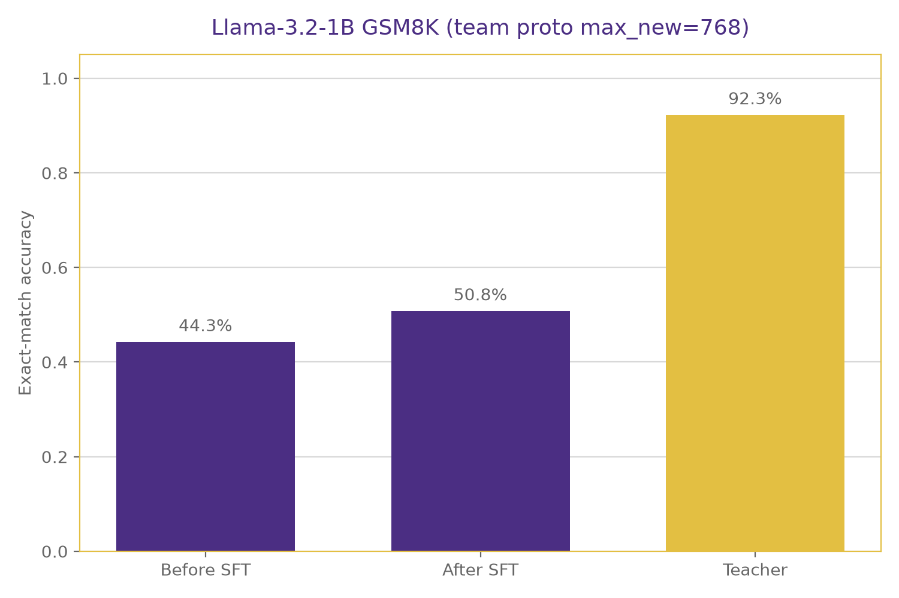
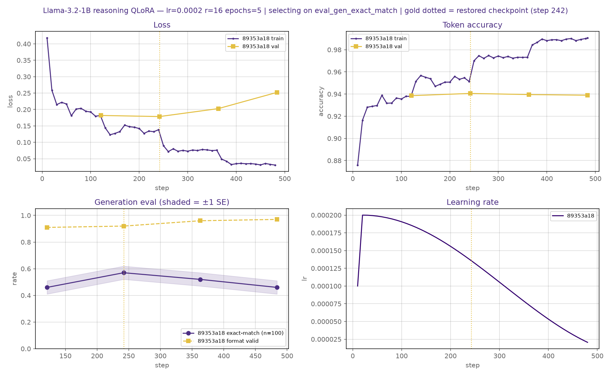
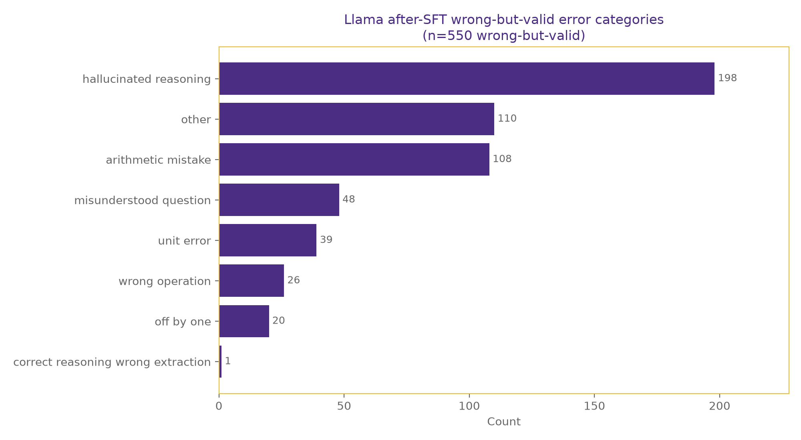

# Llama-3.2-1B Reasoning Distillation (GSM8K)

This is the **Llama-3.2-1B-Instruct student track**: Quantized Low-Rank Adaptation (QLoRA) distillation from a shared Qwen3-14B-AWQ (Activation-aware Weight Quantization) teacher on GSM8K. The shared team repo documents the full teacher + three-student pipeline; **this README focuses on Llama results, method, and reproduction.**

---

## Preview

| Section | What you’ll find |
|---------|------------------|
| [Summary](#summary) | Headline numbers in one place |
| [Research question](#research-question) | What we ask and how Llama fits the team comparison |
| [Why we chose this](#why-we-chose-this) | Teacher, student, task, and training method |
| [Results](#results) | Before/after/teacher table, McNemar, figures with captions |
| [Vs Meta’s published GSM8K](#vs-metas-published-llama-32-1b-gsm8k-444) | Fair comparison to Meta’s 44.4% card number |
| [Example](#example-teacher-vs-base-vs-distilled-student) | Short teacher / base / distilled trace |
| [Why these students differ](#why-these-students-differ-and-what-we-expected) | Architecture differences + ranked expectations |
| [What moved the score](#what-moved-the-score-ablations) | Full ablation table + what it proves |
| [Conclusion](#conclusion) | Answers to the research questions for this Llama track |
| [Method](#method-llama-track) | Pipeline + exact recipe of the official 50.8% run |
| [Reproduce](#reproduce) | Train / eval / plot commands for this track |

---

## Summary

We distill verified GSM8K chain-of-thought (CoT) from **Qwen3-14B-AWQ** into **`meta-llama/Llama-3.2-1B-Instruct`** with QLoRA. Under the team’s shared 0-shot tagged-CoT evaluator:

| Stage | Exact-match | Notes |
|-------|------------:|-------|
| Llama base (before supervised fine-tuning (SFT)) | **44.3%** (CI 41.6–46.9%) | same prompt / decode as after (`max_new_tokens=768`) |
| Llama after QLoRA (official) | **50.8%** (CI 48.1–53.5%) | official adapter; matched team budget `768` |
| Teacher Qwen3-14B-AWQ | **92.3%** | shared ceiling (`max_new_tokens=2048`) |
| **Gain over base** | **+6.5 percentage points (pp)** | 44.3 → 50.8 |
| **Gap to teacher** | **~41.5 pp** | most headroom still open |

**At a glance:** **+86** net additional correct answers (249 fixes − 163 regressions); ~**11.7%** fewer errors; ~**13.6%** of the original teacher gap closed. McNemar on the paired gain: $p \approx 2.8 \times 10^{-5}$.

**Takeaway:** distillation clearly teaches the *protocol* (tagged format + GSM8K-style answers) and recovers a bounded accuracy gain on a ~1B Llama. Residual errors are mostly **valid tags, wrong math** — a reasoning/capacity ceiling, not missing tags.

---

## Research question

How effectively can knowledge distillation transfer mathematical reasoning from a large teacher to a compact student while remaining practical for local deployment?

For **this track** specifically:

- Can QLoRA on shared teacher CoTs raise Llama-3.2-1B GSM8K exact-match under a fixed team protocol?
- Which training choices (teacher style, LoRA rank, prompt alignment) actually move the score?
- Relative to same-family / math-tuned teammates (Qwen3-1.7B, Gemma 3 1B), is cross-family Llama a harder transfer case — as expected?

---
## Why we chose this

### Why distillation (not training a big model from scratch)

Strong math/reasoning models are expensive to run and usually live in the cloud, so user prompts leave the device. A **small student** fine-tuned on a **large teacher’s** solutions can run locally (privacy, latency, cost) while still learning useful multi-step behavior. We are **not** inventing a new distillation algorithm — we measure how far shared teacher supervision carries a ~1B Llama under a fixed team protocol.

### Why GSM8K

GSM8K is a standard grade-school math word-problem benchmark with clear numeric answers. That makes distillation easy to score (exact match on the final answer) and makes “did reasoning transfer?” measurable, not subjective.

### Why the teacher: Qwen3-14B-AWQ

We needed a teacher that is **meaningfully stronger** than ~1–2B students but still runnable on a **single 24 GB GPU**.

| Option considered | Why not / why yes |
|-------------------|-------------------|
| Qwen3-32B / large R1-style teachers | Too heavy for one 24 GB card (full precision / multi-GPU needs) |
| **Qwen3-14B-AWQ** | AWQ-quantized; already working via vLLM locally; strong GSM8K ceiling (**~92.3%** under our shared eval) |

So the teacher is a practical “best reasoner we can host,” not the absolute largest model available.

### Why this student: Llama-3.2-1B-Instruct

The team trains **three** students on the **same** teacher data to compare architectures. This repo owns **Llama**:

| Reason | Detail |
|--------|--------|
| Fits the hardware | ~1B + **QLoRA (4-bit)** trains/evals on one 24 GB GPU |
| Cross-family stress test | Teacher is **Qwen**; Llama uses a different family/tokenizer — harder transfer than same-family Qwen3-1.7B |

### Why QLoRA + reasoning supervision

- **QLoRA:** full fine-tuning of even a 1B model is unnecessary for this project; 4-bit + LoRA keeps peak memory low and runs short (~tens of minutes per recipe on a 3090-class GPU).
- **Reasoning (CoT) targets:** we train on teacher `<reasoning>…</reasoning><final_answer>…</final_answer>` traces so the student learns *how* to get the answer, not only the final number — then we measure whether that actually raises exact-match (it does, modestly) vs mainly teaching the required output format (it does, strongly).

## Results

### Official Llama numbers

| Metric | Before SFT | After SFT (best) | Change |
|--------|----------:|-----------------:|--------|
| Exact-match accuracy | 44.3% (CI 41.6–46.9%) | **50.8%** (CI 48.1–53.5%) | **+6.5 pp** |
| Correct-and-valid | 29.4% | **50.7%** | **+21.3 pp** |
| Valid format | 58.8% | **92.4%** | **+33.7 pp** |
| Truncation | 0.8% | 7.4% | +6.6 pp (longer CoTs) |
| Avg latency | ~2.1 s / ex | ~5.2 s / ex | longer generations |
| Peak GPU (eval) | ~2.4 GB | ~2.4 GB | similar |

Best validation checkpoint during training was `checkpoint-242` (val generation exact-match (EM) 0.57); full test on that checkpoint was 50.6%. We report **`final_adapter` at 50.8%** as the official student result under the team-matched `max_new_tokens=768` eval.

**Metrics paths**
- Before: [`outputs/llama/before_sft/meta-llama_Llama-3.2-1B-Instruct_before_sft_91626410_max768_metrics.json`](../../outputs/llama/before_sft/meta-llama_Llama-3.2-1B-Instruct_before_sft_91626410_max768_metrics.json)
- After: [`outputs/llama/after_sft/meta-llama_Llama-3.2-1B-Instruct_after_sft_35f35fce_max768_metrics.json`](../../outputs/llama/after_sft/meta-llama_Llama-3.2-1B-Instruct_after_sft_35f35fce_max768_metrics.json)
- McNemar (SFT gain): [`outputs/llama/analysis/mcnemar_before_vs_after_max768.json`](../../outputs/llama/analysis/mcnemar_before_vs_after_max768.json)
- McNemar (vs teacher): [`outputs/llama/analysis/mcnemar_student_vs_teacher_max768.json`](../../outputs/llama/analysis/mcnemar_student_vs_teacher_max768.json)

### How the +6.5 pp gain breaks down
| Metric | Value | Meaning |
|--------|------:|---------|
| Net additional correct | **+86** | 249 fixed − 163 regressed |
| Error reduction | **~11.7%** | 735 → 649 incorrect / 1,319 |
| Teacher gap closed | **~13.6%** | (~48.0 → ~41.5 pp gap) / 48.0 |
Paired view: of 412 answers that changed, **60.4%** improved (~1.5 fixes per regression). McNemar $p \approx 2.8 \times 10^{-5}$.

### Figure 1 — Accuracy: base vs distilled Llama vs teacher


*Before vs after SFT only (`max_new_tokens=768`): **44.3% → 50.8%**.*



**What this shows:** under the same GSM8K test set and shared evaluator (`max_new_tokens=768`), distillation lifts Llama from 44.3% to 50.8%, while the teacher remains far ahead at 92.3%.

**Tied to the research question:** knowledge distillation recovers a meaningful slice of teacher performance on a privacy-friendly 1B model, but architecture/scale still dominate the remaining gap.

### Question-level paired analysis (McNemar)
Same 1,319 problems before vs after:
| Transition | Count |
|------------|------:|
| Correct → Correct | 421 |
| Wrong → Wrong | 486 |
| Wrong → Correct (**fixed**) | **249** |
| Correct → Wrong (**regressed**) | **163** |
- Net gain: $249 - 163 = 86$ (= 584 → 670 correct).
- Of 412 changed items, **60.4%** improved (~**1.5** fixes per regression).
- McNemar (before vs after): $p \approx 2.8 \times 10^{-5}$
- McNemar (student vs teacher): $p \approx 1.3 \times 10^{-113}$ (teacher wins 564 / 581 disagreements)

### Teacher gap closed
| Condition | Exact-match | Gap to teacher (92.27%) |
|-----------|------------:|------------------------:|
| Llama base | 44.3% | **~48.0 pp** |
| Llama distilled | 50.8% | **~41.5 pp** |
| Gap closed | — | **~6.5 pp ≈ 13.6%** of the original gap |
Transfer is **real but partial**. Same-family Qwen3-1.7B (~79.6% after SFT in the teammate track) sits closer to the teacher.

### Figure 2 — Training curves



**What this shows:** loss and generation exact-match over training for the official `train_v3` v4 run using the updated shared prompt (MLflow run `89353a18…`).

**Tied to the research question:** learning is stable; we select checkpoints on **generation EM** (not only eval loss), which better tracks the primary metric.

These four panels track the official QLoRA run (learning rate 2e-4, LoRA rank 16). Training loss falls and token accuracy rises through the run, which can look like steady improvement. Validation loss, however, bottoms out around step 242 and then climbs, a sign of overfitting if we keep training. The generation panel is the important one for our research question: on a 100-example probe, exact-match peaks near 0.57 at step 242 and then drops, even while “format valid” stays high. That tells us the model can keep producing well-tagged answers while the actual numeric answers get worse. The gold dotted line marks the checkpoint we select by generation exact-match rather than by loss alone. The learning-rate panel simply shows warmup to 2e-4 followed by cosine decay. Overall, the curves justify early stopping on answer quality, not on next-token loss.

### Figure 3 — Error categories after distillation



**What this shows:** heuristic triage of wrong-but-valid answers (`outputs/llama/analysis/error_analysis_max768/`). Labels are automatic and noisy — use for qualitative discussion, not exact taxonomy %.

**Tied to the research question:** after SFT, failures are dominated by **reasoning/arithmetic mistakes with valid tags** (~649 incorrect; ~550 wrong-but-valid), not missing tags. Further gains need better reasoning transfer, not more format engineering.

This chart looks only at cases where the distilled Llama produced a valid tagged answer but the final number was wrong (550 wrong-but-valid examples, labeled with noisy heuristics). The biggest slice is hallucinated reasoning: the write-up looks step-by-step, but the logic invents facts or goes off track. Arithmetic mistakes are common too, followed by misunderstanding the question, unit errors, and wrong operations. Almost never does the model reason correctly and then fail only at extracting the answer. Together with the full-test pattern—mostly wrong answers with valid tags, not missing tags—this says distillation taught the required format well. What still fails is multi-step reasoning itself. Closing more of the gap to the teacher therefore needs better reasoning transfer (or a stronger student), not more work on output tags.

### Vs Meta’s published Llama-3.2-1B GSM8K (44.4%)

#### Fair comparison first

| | Meta Llama-3.2-1B-Instruct (model card) | Our best Llama student |
|--|----------------------------------------|-------------------------|
| GSM8K score | **44.4%** | **50.8%** |
| Training on GSM8K | No (base Instruct; GSM8K is a benchmark) | **Yes** — QLoRA SFT on verified teacher CoTs |
| Shots | **8-shot** CoT | **0-shot** |
| Prompt | Meta few-shot CoT | Tagged `<reasoning>` / `<final_answer>` (shared team prompt) |
| Decoding | `em_maj1@1` (1 sample) | Greedy (`temperature=0`), 1 decode |
| Metric idea | Exact match on final answer | Exact match on final answer |

**Claim we make:** under our shared 0-shot tagged protocol, after distillation, Llama reaches **50.8%**, which is **above Meta’s published 44.4%** and **+6.5 pp** over our own base (**44.3%**).
**Claim we do *not* make:** that we beat Meta’s training recipe under Meta’s 8-shot setup.

### Example: teacher vs base vs distilled student

One short GSM8K item where the base is wrong, the distilled student matches the teacher, and both use the tagged format:

**Problem.** A juggler can juggle 16 balls. Half of the balls are golf balls, and half of the golf balls are blue. How many blue golf balls are there? **Gold: 4**

**Base Llama (before SFT) — wrong (predicted 8):**
```text
<reasoning>
To find the number of blue golf balls, we need to first find the total number of golf balls and then find half of that number.
The total number of golf balls is 16.
Half of the golf balls are blue, so we need to divide 16 by 2 to find the number of blue golf balls.
<final_answer>8</final_answer>
```

**Distilled Llama (after SFT) — correct:**
```text
<reasoning>
Step 1: The juggler can juggle 16 balls.
Step 2: Half of the balls are golf balls, so 16 / 2 = 8 golf balls.
Step 3: Half of the golf balls are blue, so 8 / 2 = 4 blue golf balls.
</reasoning>
<final_answer>4</final_answer>
```

**Teacher (Qwen3-14B-AWQ) — correct:**
```text
<reasoning>
1. The juggler can juggle 16 balls.
2. Half of the balls are golf balls, so the number of golf balls is 16 / 2.
3. Half of the golf balls are blue, so the number of blue golf balls is (16 / 2) / 2.
</reasoning>
<final_answer>4</final_answer>
```

The base already attempts tags but skips a step; after distillation the student follows the teacher-style one-op-per-step chain and lands on the right answer.

---

## Why these students differ (and what we expected)

The team compares three ~1–2B students under the **same teacher data, splits, prompts, and shared evaluator**. Generation length caps are matched for the student scoreboard (**Llama and Qwen: `max_new_tokens=768`**); the teacher reference uses **2048**. They are not interchangeable “1B models”:

| | Qwen3-1.7B (teammate) | Gemma 3 1B (teammate) | **Llama 3.2 1B (this repo)** |
|---|---|---|---|
| Layers | 28 | 26 | **16** |
| Hidden dim | 2048 | 1152 | **2048** |
| Attention | Grouped-query attention (GQA) | Local sliding-window + global | **GQA every layer** |
| Tokenizer | Byte-level byte-pair encoding (BBPE) (~152k) | SentencePiece (~262k) | **Byte-pair encoding (BPE) (~128k)** |
| Build history | Dense pretrain + thinking mode | Post-trained with knowledge distillation (KD) from a larger instruct model | **Pruned from Llama 3.1 8B, then KD-recovered** |
| Relation to teacher | **Same family** as Qwen3-14B | Different family | **Different family** from Qwen teacher |

**Ranked expectations (stated before cross-model merge):**

1. **Qwen3-1.7B** — highest expected *absolute* accuracy (scale, pretraining, same family as teacher CoTs).
2. **Llama-3.2-1B** — may show large *relative* gain from a second teacher-based step (already KD-shaped in its lineage), but **harder cross-family transfer** than Qwen; useful stress test.
3. **Gemma 3 1B** — strong math post-training; expected competitive baseline vs Llama, edge after distillation TBD.

**This track’s result in that frame:** Llama gained **+6.5 pp** under the matched `768` eval (44.3% → 50.8%). Intermediate ablations below were measured during development; the official scoreboard is the `max768` before/after pair.

---

## What moved the score (ablations)

### What happened (in order)

1. **First teacher data (v3)** — “concise” CoT with a **2–8 step** bias.
2. **Trained on v3** — reached ~**49%** EM, but hard problems often lacked clear step-by-step arithmetic.
3. **Regenerated teacher data (v4)** — removed the “concise” / “2–8 steps” constraints; required **one arithmetic operation per step** with symbolic equations so small students can follow hard items.
4. **Updated the shared prompt protocol** for that v4 style; v3 had already used its own matched train/eval prompt.
5. **Official team evaluation** scores the v4 student and base with the same prompt and `max_new_tokens=768`.

Same student (`meta-llama/Llama-3.2-1B-Instruct`), same shared GSM8K test (1,319), greedy eval unless noted.

| Step | Stage | Data | lr | LoRA r / α | Epochs / selection | Other | Test EM | vs Meta 44.4% |
|------|--------|------|---:|-------------:|--------------------|--------|--------:|:-------------:|
| A | Base, no SFT | — | — | — | — | Shared **v4** eval prompt; greedy; `max_new_tokens=768`; bf16 | **44.3%** | below |
| B | First distillation (`train_v2`) | Teacher **v3** (concise, ~2–8 steps) | `2e-4` | `16` / `32` | up to **3** epochs; best by **eval loss** | QLoRA; batch `4×4` (eff. 16); `max_seq_length=1024`; dropout `0.05` | **~49.0%** | above |
| C | v4 data + updated shared prompt (`train_v3`) | Teacher **v4** (one-op-per-step) | `2e-4` | `16` / `32` | early stop on **gen-EM** (n=100) | Same QLoRA recipe as B otherwise; v4 prompt used consistently | **48.9%** | above |
| D | Capacity check | Teacher **v4** | `2e-4` | **`32` / `64`** | early stop on **gen-EM** (n=100) | Same as C except larger LoRA | **48.7%** | above |
| E | Lower LR | Teacher **v4** | **`1e-4`** | `16` / `32` | **3** or **5** ep (`…_lr1e4_ep3`, `…_aligned_lr1e4_r16`) | Did **not** beat official `2e-4`; train gen-EM peak 0.53 (full test skipped on one run) | **~49.5%** | — |
| **F (official)** | Matched-budget team evaluation | Teacher **v4** | `2e-4` | `16` / `32` | early stop on **gen-EM** (n=100) | v4 shared prompt; official base/after test `max_new_tokens=768` | **50.8%** | **above (+6.4 pp vs Meta card)** |

**What the table proves**
1. **SFT alone** (B/C) already clears Meta’s **44.4%** (~49%), mainly by teaching the tagged format + GSM8K-style solutions.
2. Moving from matched v3 concise CoTs to v4 detailed CoTs plus the updated shared prompt did **not** materially beat v3 in the development comparison (~48.9% ≈ 49.0%).
3. **More LoRA rank (r=32)** did **not** help (D ≤ C).
4. The **official matched-budget result (50.8%)** is the v4 r=16 model evaluated at the shared student cap (`max_new_tokens=768`). Because v3 already used its matching prompt, this comparison does not isolate prompt alignment as the cause of the gain.

---

## Conclusion

For the Llama-3.2-1B track, knowledge distillation **does** transfer useful GSM8K capability under a fixed team protocol, but only **partway** toward the teacher:

1. **Distillation works, and the gain is real.** Exact-match rises **44.3% → 50.8%** (+6.5 pp; McNemar ($p \approx 2.8 \times 10^{-5}$)). Format adherence jumps (~59% → ~92%), so the student becomes a reliable tagged-CoT solver, not only a slightly better guesser.
2. **Most teacher performance is still missing.** The gap to Qwen3-14B-AWQ (~92.3%) remains ~**41.5 pp** (McNemar ($p \approx 1.3 \times 10^{-113}$)). Residual failures are mostly **valid tags, wrong math** — a reasoning/capacity ceiling on a cross-family ~1B model, not a formatting bug.
3. **What actually moved the needle:** SFT on verified teacher CoTs gets you to ~49% in development ablations. The official **50.8%** uses v4 one-op-per-step CoTs with an updated shared train/eval prompt, scored at team-matched `max_new_tokens=768`. Larger LoRA (r=32) did not help.
4. **Efficiency / local deployment:** eval stays light (~2.4 GB peak); latency rises (~2.1 → ~5.2 s/ex) because generations are longer. Those times are batch-1 `transformers` wall-clock on this track’s GPU — not matched against the teacher’s vLLM server. For privacy-preserving local use, the distilled 1B student is practical hardware-wise, but accuracy is still far from the 14B teacher — good enough for some offline assistive use, not a drop-in replacement for cloud-scale reasoning.
5. **Team architecture hypothesis (this track):** Llama behaves like the expected **harder cross-family** student — clear relative gain from distillation, large absolute gap left for same-family / stronger students (Qwen, Gemma) to fill in the shared comparison.

**Bottom line:** QLoRA distillation of Qwen3-14B-AWQ CoTs into Llama-3.2-1B is a statistically significant, reproducible win on GSM8K under the shared evaluator, driven mainly by protocol learning plus modest reasoning transfer; closing the remaining gap needs stronger students, better data, or methods beyond single-pass tagged SFT — not more tag engineering.

---

## Method (Llama track)

```text
Qwen3-14B-AWQ (teacher, shared)
  → gsm8k_teacher_v4 SFT JSONL (1,922 train / 485 val accepted)
  → student/llama/train_v3.py  QLoRA (shared v4 prompt)
  → evaluation/evaluate_gsm8k.py  (greedy GSM8K test)
```

### Exact recipe of the run that scored 50.8% (official max768)

| Knob | Value used |
|------|------------|
| Script | `student/llama/train_v3.py` |
| Base model | `meta-llama/Llama-3.2-1B-Instruct` |
| Method | QLoRA SFT (assistant-token loss only) |
| Teacher data | `gsm8k_teacher_v4` / hash `434a9551e7` (~1922 train / 485 val) |
| Variant | `reasoning` |
| Learning rate | `2e-4` (cosine + warmup) |
| LoRA r / α / dropout | `16` / `32` / `0.05` |
| Target modules | `q_proj, k_proj, v_proj, o_proj, gate_proj, up_proj, down_proj` |
| Batch × grad accum | `4 × 4` (effective 16) |
| `max_seq_length` | `1024` |
| NEFTune α | `5.0` |
| Checkpoint selection | `eval_gen_exact_match` (n=100), early stopping |
| Prompt protocol | Updated shared v4 `SYSTEM_PROMPT` + `USER_TEMPLATE = "Problem:\n{question}"` used consistently for the official v4 run |
| Adapter path | `outputs/llama3_1b_v4_promptmatch_r16_lr2e4/final_adapter` |
| Eval | shared `evaluate_gsm8k.py`, `--stage after_sft`, greedy, `max_new_tokens=768` |
| Metrics file | `outputs/llama/after_sft/meta-llama_Llama-3.2-1B-Instruct_after_sft_35f35fce_max768_metrics.json` |

**Best-run secondary metrics (proof it’s not just format hacking):**
- Exact-match: **50.8%** (CI 48.1–53.5%)
- Correct-and-valid: **50.7%**
- Valid format: **92.4%**
- Truncation: **7.4%**
- Dominant failure: **wrong_answer with valid tags** (~649 incorrect; ~550 wrong-but-valid) — reasoning errors, not missing tags

Teacher generation lives in `teacher/` and the Llama environment is defined by `student/llama/requirements-llama.txt`.

**Do not** run teacher vLLM and student QLoRA on the same GPU at once.

---

## Data (used by this track)

| Split | Accepted SFT | Path |
|-------|-------------:|------|
| Train | 1,922 | [`data/teacher_gsm8k_train_..._v4_..._full_sft.jsonl`](../../data/teacher_gsm8k_train_qwen3_14b_awq_gsm8k_teacher_v4_434a9551e7_full_sft.jsonl) |
| Val | 485 | [`data/teacher_gsm8k_val_..._v4_..._full_sft.jsonl`](../../data/teacher_gsm8k_val_qwen3_14b_awq_gsm8k_teacher_v4_434a9551e7_full_sft.jsonl) |
| Test | 1,319 official GSM8K | untouched during training |

---

## Reproduce

Llama weights require a Hugging Face account and accepting the Meta Llama 3.2 community license on the model card, then:

```bash
huggingface-cli login
```

```bash
cd /path/to/teacher-student-distillation
python -m venv .venv && source .venv/bin/activate
pip install -r student/llama/requirements-llama.txt

# Train (official shared-v4-prompt recipe)
python student/llama/train_v3.py --variant reasoning \
  --train_file data/teacher_gsm8k_train_qwen3_14b_awq_gsm8k_teacher_v4_434a9551e7_full_sft.jsonl \
  --val_file data/teacher_gsm8k_val_qwen3_14b_awq_gsm8k_teacher_v4_434a9551e7_full_sft.jsonl \
  --lr 2e-4 --r 16 --alpha 32 \
  --output_dir outputs/llama3_1b_v4_promptmatch_r16_lr2e4

# Eval — base (before SFT)
python evaluation/evaluate_gsm8k.py \
  --backend transformers \
  --model meta-llama/Llama-3.2-1B-Instruct \
  --stage before_sft \
  --max-input-tokens 1536 \
  --max-new-tokens 768

# Eval — distilled (after SFT; team-matched generation budget)
python evaluation/evaluate_gsm8k.py \
  --backend transformers \
  --model meta-llama/Llama-3.2-1B-Instruct \
  --adapter-path outputs/llama3_1b_v4_promptmatch_r16_lr2e4/final_adapter \
  --stage after_sft \
  --max-input-tokens 1536 \
  --max-new-tokens 768

# McNemar (CPU-only; uses existing prediction jsonl)
python evaluation/poster_analysis.py compare \
  --predictions-a outputs/llama/before_sft/meta-llama_Llama-3.2-1B-Instruct_before_sft_91626410_max768_predictions.jsonl \
  --predictions-b outputs/llama/after_sft/meta-llama_Llama-3.2-1B-Instruct_after_sft_35f35fce_max768_predictions.jsonl \
  --label-a before_sft --label-b after_sft \
  --output outputs/llama/analysis/mcnemar_before_vs_after_max768.json

python evaluation/poster_analysis.py compare \
  --predictions-a outputs/llama/after_sft/meta-llama_Llama-3.2-1B-Instruct_after_sft_35f35fce_max768_predictions.jsonl \
  --predictions-b outputs/teacher_testset/Qwen_Qwen3-14B-AWQ_teacher_3cb9a5c9_predictions.jsonl \
  --label-a after_sft --label-b teacher \
  --output outputs/llama/analysis/mcnemar_student_vs_teacher_max768.json

# Plots (optional)
python student/llama/plot_v3.py
python student/llama/analyze_wrong_ans.py \
  --predictions outputs/llama/after_sft/meta-llama_Llama-3.2-1B-Instruct_after_sft_35f35fce_max768_predictions.jsonl \
  --out-dir outputs/llama/analysis/error_analysis_max768
python student/llama/plot_wrong_ans.py \
  --summary outputs/llama/analysis/error_analysis_max768/summary.json \
  --out outputs/llama/analysis/error_analysis_max768/error_categories_purple_gold.png
```
---

## Privacy & ethics

Privacy is the **application motivation** (local 1B student, prompts on-device), not a novel privacy algorithm.

- Public GSM8K + published model licenses; no private user data in core experiments.
- Llama access requires Meta’s community license.
- Report null or small gains honestly.

---

## Licenses & references

- **Llama 3.2:** [meta-llama/Llama-3.2-1B-Instruct](https://huggingface.co/meta-llama/Llama-3.2-1B-Instruct)
- **Qwen3-14B-AWQ / GSM8K / libraries:** see respective HF cards and OSS licenses

1. Cobbe et al. (2021). GSM8K. https://arxiv.org/abs/2110.14168
2. Hu et al. (2021). LoRA. https://arxiv.org/abs/2106.09685
3. Dettmers et al. (2023). QLoRA. https://arxiv.org/abs/2305.14314
4. Hinton et al. (2015). Distilling the Knowledge in a Neural Network.
5. Meta AI. Llama 3.2 model card.
